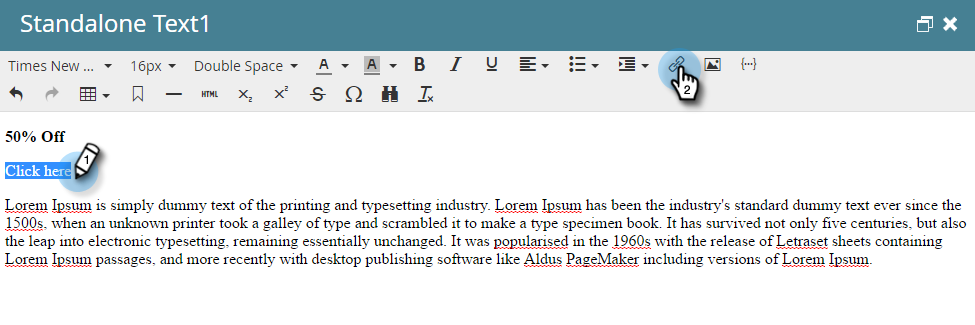

# Añadir tokens a un vínculo de correo electrónico {#add-tokens-to-an-email-link}

Para insertar parámetros adicionales y específicos de la persona en los vínculos, puede utilizar tokens. Así es como.

1. Seleccione el correo electrónico y haga clic en **Editar borrador** pestaña.

   

1. Haga doble clic en un área editable.

   

1. Busque o escriba el texto del vínculo. Resáltelo y haga clic en **Insertar/editar vínculo** icono.

   

1. Escriba los tokens que desee en **URL** y haga clic en **Insertar**.

   

1. Clic **Guardar**.

   

   ¡Y eso es todo!

>[!MORELIKETHIS]
>
>[Uso de URL en Mis tokens](/help/marketo/product-docs/email-marketing/general/using-tokens/using-urls-in-my-tokens.md)
