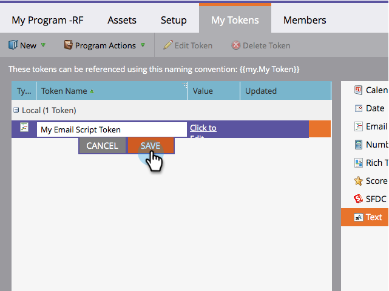

# Creación de un token de script de correo electrónico {#create-an-email-script-token}

Para desarrolladores avanzados, puede usar [Secuencias de comandos de Velocity](https://velocity.apache.org/engine/1.7/user-guide.html) en sus correos electrónicos. Así es como hacerlo.

1. Vaya a **Actividades de marketing**.

   

1. Busque y seleccione cualquier programa (Evento, Predeterminado, Participación, etc.).

   

1. En el **Mis tokens** , arrastre **Script de correo electrónico** token.

   

1. Asigne un nombre al token de script de correo electrónico y **haga clic para editar** su contenido.

   

1. Utilice el árbol de la derecha para arrastrar **Persona, oportunidad** o **Objeto personalizado** tokens.

   

   >[!NOTE]
   >
   >Al acceder a una matriz (oportunidad u objeto personalizado), está limitado a los últimos 10 elementos asociados a la persona.

1. Observe que el token se activa o marca después de arrastrarlo al editor de secuencias de comandos.

   

   >[!NOTE]
   >
   >Si está escribiendo en tokens de forma libre, asegúrese de comprobar/activar todos los tokens correspondientes en el árbol; de lo contrario, se tratarán como texto sin formato y no funcionarán.

1. Escriba el script en Velocity. Estos son algunos recursos útiles:

   * [Documentación de secuencias de comandos de correo electrónico para desarrolladores de Marketo](https://developers.marketo.com/email-scripting/)
   * [Guía del usuario de Velocity](https://velocity.apache.org/engine/devel/user-guide.html)
   * [Guía de referencia de Velocity](https://velocity.apache.org/engine/devel/vtl-reference-guide.html)
   * [Herramientas de Velocity Javadoc](https://velocity.apache.org/tools/releases/2.0/javadoc/index.html)

1. Una vez completada la secuencia de comandos, haga clic en **Guardar**.

   

1. Haga clic en **Guardar** una vez más.

   

Ahora puede utilizar este token en sus correos electrónicos. Ejecutará la secuencia de comandos cada vez que se envíe un correo electrónico.

>[!MORELIKETHIS]
>
>[Añadir un token de script de correo electrónico al correo electrónico](/help/marketo/product-docs/email-marketing/general/using-tokens/add-an-email-script-token-to-your-email.md)
