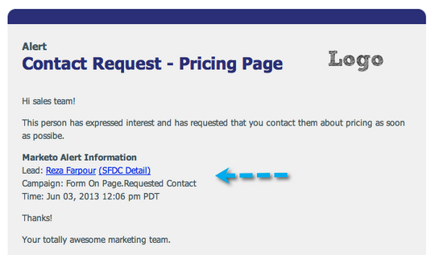
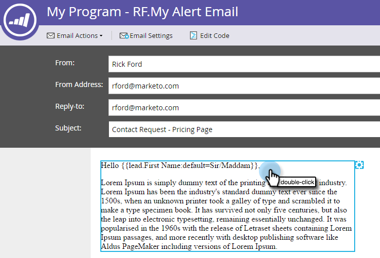
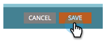

# Usar el token de información de alerta de envío {#use-the-send-alert-info-token-sp-send-alert-info}

La variable `{{SP_Send_Alert_Info}}` token es un token especial que se utilizará al crear correos electrónicos de alerta para su equipo de ventas.

>[!TIP]
>
>Este token solo funciona según lo previsto al enviar el correo electrónico que lo contiene con la variable [Enviar alerta](/help/marketo/product-docs/core-marketo-concepts/smart-campaigns/flow-actions/send-alert.md) paso de flujo. No funcionará cuando se utilice en un paso de flujo de envío de correo electrónico.

Ejemplo de alerta:

>[!NOTE]
>
>¡Cara! Las direcciones URL de las alertas tienen fechas de caducidad, por lo que debe asegurarse de que tengan una cadencia que admita este tipo de mensajes. Las fechas de caducidad son [configurado por un administrador](/help/marketo/product-docs/administration/settings/edit-link-expiration-in-reports-and-alerts.md).

La siguiente información se incluye como parte del `{{SP_Send_Alert_Info}}`:

* Nombre y apellidos como vínculo a los detalles de la persona en Marketo
* Un vínculo a la persona en su CRM
* El nombre de la campaña en Marketo que envió la alerta
* Hora a la que se envió la alerta

>[!NOTE]
>
>El vínculo a CRM solo aparecerá si la persona está en el sistema CRM (actualmente no disponible con Dynamics CRM). El vínculo es accesible para usuarios de Marketo y usuarios que no sean de Marketo.

## Añadir el token SP_Send_Alert_Info a un mensaje de correo electrónico {#add-the-sp-send-alert-info-token-to-an-email}

1. Seleccione el correo electrónico y haga clic en **Editar borrador**.

   

1. Haga doble clic en el área editable a la que desee agregar el token.

   

1. Sitúe el cursor donde desee que esté el token y, a continuación, haga clic en el botón **Insertar token** botón.

   

1. Busque y seleccione el **`{{SP_Send_Alert_Info}}`** token y clic **Insertar**.

   

1. Haga clic en **Guardar**.

   

>[!NOTE]
>
>No olvide aprobar su correo electrónico.

¡Qué bien! Este token es muy útil y debe utilizarlo en todas las alertas que cree para su equipo de ventas.
