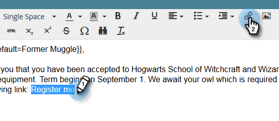
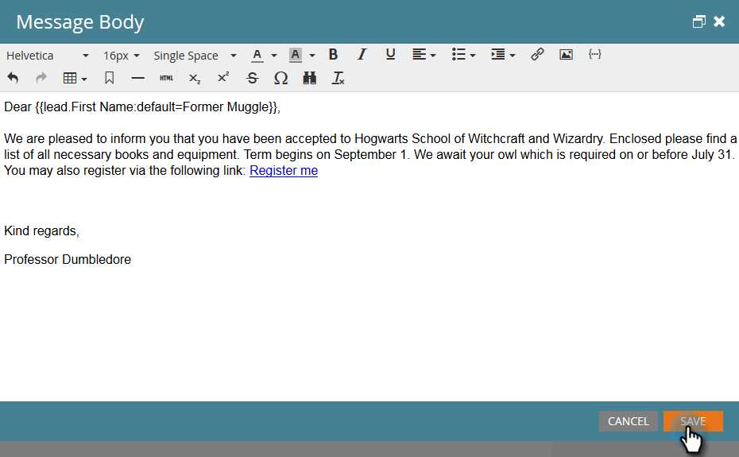

# Uso de direcciones URL en Mis tokens {#using-urls-in-my-tokens}

Siga los pasos a continuación para usar Mis tokens para insertar direcciones URL en los correos electrónicos.

1. Seleccione el programa y haga clic en **Mis tokens**.

   

1. Seleccione el **Texto** Mi token, arrástrelo y suéltelo en el lienzo.

   

1. Asigne un nombre único al token, introduzca una dirección URL (sin https://) y haga clic en **Guardar**.

   

   >[!CAUTION]
   >
   >Para asegurarse de que se rastrean los clics en el correo electrónico, **no** escriba https:// dentro del valor del token.

1. Seleccione el correo electrónico en el programa.

   

1. Haga clic en **Editar borrador**.

   

1. Haga clic con el doble en el área de texto que desee editar.

   

1. En cualquier lugar del correo electrónico, escriba &quot;https://&quot; (sin dejar espacio después) y haga clic en el icono Insertar token.

   

   >[!NOTE]
   >
   >Por supuesto, usted también tiene la opción de ingresar &quot;https&quot; si su sitio lo utiliza.

1. Busque su Mi token, selecciónelo y haga clic en **Insertar**.

   

1. Resalte el https:// y el token y, a continuación, pulse Ctrl/Cmd+X (Ctrl = Windows/Cmd = Mac) para cortar el texto.

   

1. Resalte el texto que desea que se muestre el vínculo y haga clic en el icono Insertar/Editar vínculo.

   

1. Pulse Ctrl/Cmd+V para pegar el contenido en el cuadro **URL** y haga clic en **Insertar**.

   

1. Haga clic en **Guardar**.

   

   ¡Y ya terminaste! La dirección URL se rellenará después de enviar y, gracias a haber colocado https:// delante del token, se generará un vínculo rastreable.
