# Uso de los URL en Mis tókenes {#using-urls-in-my-tokens}

Siga los pasos a continuación para usar [!UICONTROL Mis tokens] para insertar direcciones URL en sus correos electrónicos.

1. Seleccione su programa y haga clic en **[!UICONTROL Mis tokens]**.

   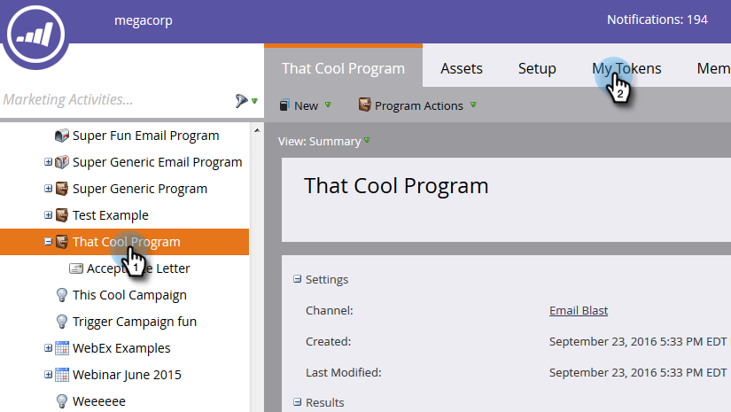

1. Seleccione el **[!UICONTROL Texto]** Mi token, arrástrelo y suéltelo en el lienzo.

   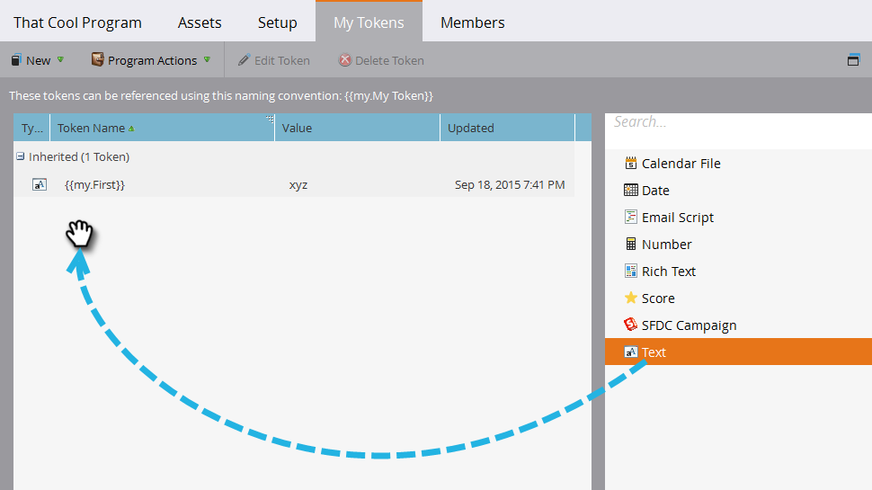

1. Asigne un nombre único al token, escriba una dirección URL (sin el https://) y haga clic en **[!UICONTROL Guardar]**.

   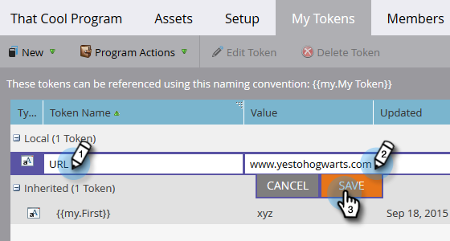

   >[!CAUTION]
   >
   >**Usando http/https...**
   >
   >* Para asegurarse de que se hace un seguimiento de los clics en el correo electrónico, haga que **no** escriba https:// _en_ el valor del token. Utilícelo fuera del token, como se muestra en el paso 7.
   >
   >* Recomendamos encarecidamente no dejar fuera el http/https. Si lo hace, la [versión web](/help/marketo/product-docs/email-marketing/general/functions-in-the-editor/add-a-view-as-web-page-link-to-an-email.md){target="_blank"} de su correo electrónico podría procesarse incorrectamente.

1. Seleccione el correo electrónico en el programa.

   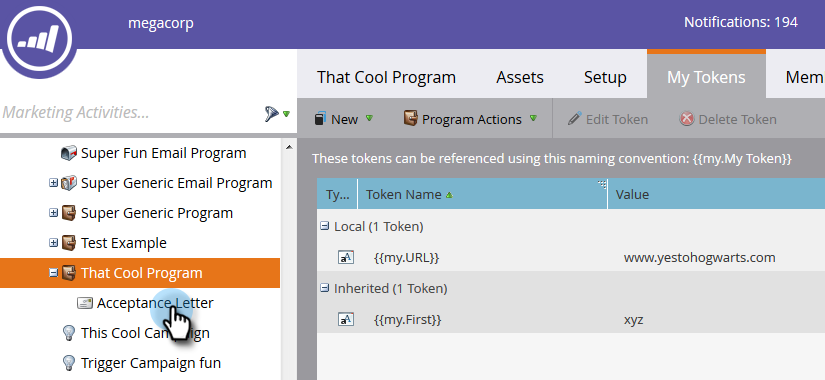

1. Haga clic en **[!UICONTROL Editar borrador]**.

   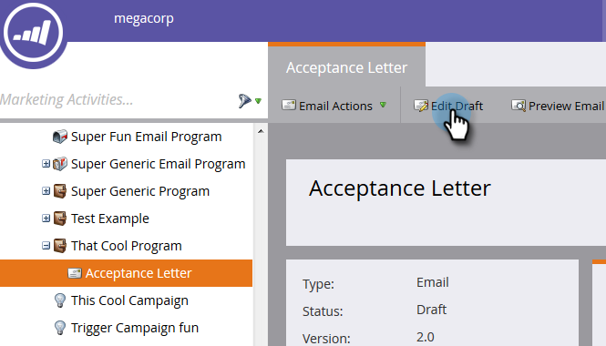

1. Haga doble clic en el área de texto para editarla.

   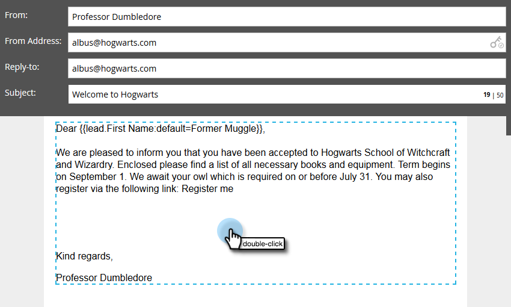

1. En cualquier parte del correo electrónico, escriba `https://` (sin dejar espacio después) y haga clic en el icono Insertar token.

   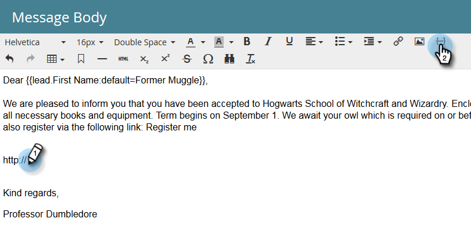

   >[!NOTE]
   >
   >Por supuesto, también tiene la opción de ingresar `http://` si su sitio no utiliza https.

1. Busque mi token, selecciónelo y haga clic en **[!UICONTROL Insertar]**.

   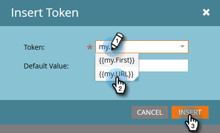

1. Resalte el https:// y el token y, a continuación, pulse Ctrl/Cmd+X (Ctrl = Windows/Cmd = Mac) para cortar el texto.

   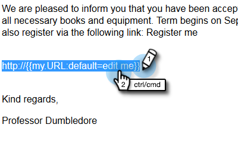

1. Resalte el texto que desee que muestre el vínculo y haga clic en el icono [!UICONTROL Insertar/Editar vínculo].

   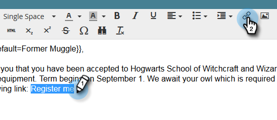

1. Presione Ctrl/Cmd+V para pegar el contenido en el cuadro **[!UICONTROL URL]** y haga clic en **[!UICONTROL Insertar]**.

   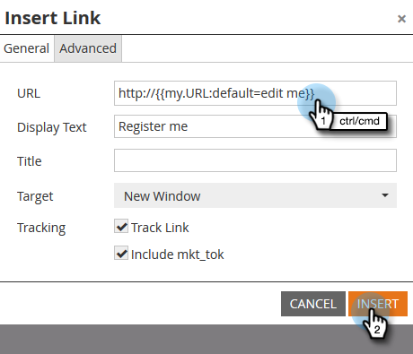

1. Haga clic en **[!UICONTROL Guardar]**.

   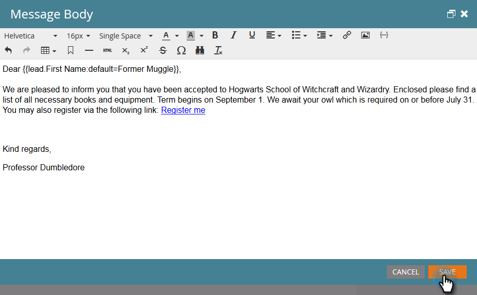

   ¡Y has terminado! La dirección URL se rellenará después del envío y, gracias a que pone https:// delante del token, se generará un vínculo al que se puede realizar un seguimiento.
