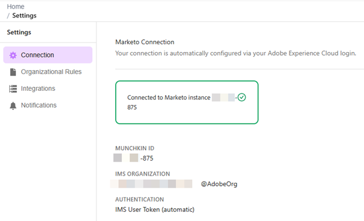

# Configuración y configuración {#settings-setup}

Obtenga información sobre cómo habilitar permisos y utilizar el área Configuración para ver los detalles de conexión, definir reglas organizativas y configurar integraciones y notificaciones.

>[!AVAILABILITY]
>
>Esta función se encuentra actualmente en la versión beta abierta. Para solicitar acceso, póngase en contacto con su administrador de cuentas de. También debe aceptar los términos de la [generación principal de IA y los términos complementarios](https://www.adobe.com/legal/terms/enterprise-licensing/genai-ww.html){target="_blank"}.

## Permisos y funciones {#permission-and-role}

Hay un permiso de _Acceso a Marketo AI_ y un rol de _Usuario de Marketo AI_, lo que proporciona a los administradores un mayor control sobre los usuarios que pueden acceder a la función **Marketo AI**. El permiso se asigna en el nivel de rol. El rol _Usuario de Marketo AI_ viene con el permiso _Acceder a Marketo AI_ habilitado de forma predeterminada.

>[!IMPORTANT]
>
>El permiso _Acceder a Marketo AI_ no está habilitado de forma predeterminada para todas las funciones. Consulte la tabla siguiente para obtener más información.

| Función | Estado predeterminado |
| --- | --- |
| Administrador | Habilitado |
| Administrador de productos de Adobe | Habilitado |
| Usuario de marketing | Desactivado |
| Usuario estándar | No disponible |
| Usuario de Marketo AI | Habilitado |
| Funciones personalizadas | Desactivado |

### Acceso al permiso de Marketo AI {#access-marketo-ai-permission}

Siga los pasos a continuación para habilitar _Acceder a Marketo AI_ para calificar roles que aún no lo tengan habilitado.

1. En Mi Marketo, haz clic en **Administrador**, luego en **Usuarios y roles**.

   

1. En la ficha _Roles_, seleccione el rol que desee y haga clic en **Editar rol**.

   

1. Desplácese hacia abajo y marque la casilla _Acceder a Marketo AI_ y haga clic en **Guardar**.

   

   >[!NOTE]
   >
   >Puede seguir estos mismos pasos para quitar el permiso **un** marcando la casilla de verificación _Acceder a Marketo AI_.

### Función de usuario de Marketo AI {#marketo-ai-user-role}

Sigue estos pasos para asignar un usuario específico al rol _Usuario de Marketo AI_.

>[!NOTE]
>
>Este rol **solamente** contiene el permiso _Acceder a Marketo AI_.

1. En Mi Marketo, haz clic en **Administrador**, luego en **Usuarios y roles**.

   

1. Seleccione el usuario que desee y haga clic en **Editar usuario**.

   

1. En _Roles y espacios de trabajo_, seleccione la casilla de verificación _Usuario de Marketo AI_. Si tiene más de un área de trabajo, puede especificar cuáles recibirán acceso en la lista desplegable de signo **+**. Haga clic en **Guardar** cuando termine.

   

### Función personalizada {#custom-role}

También tiene la opción de [crear una nueva función](https://experienceleague.adobe.com/en/docs/marketo/using/product-docs/administration/users-and-roles/create-delete-edit-and-change-a-user-role#create-a-role){target="_blank"} y personalizar sus permisos, agregando _Acceder a Marketo AI_, junto con cualquier otra cosa que desee, y [asignar esa función](https://experienceleague.adobe.com/en/docs/marketo/using/product-docs/administration/users-and-roles/managing-user-roles-and-permissions#assign-roles-to-a-user){target="_blank"} a usuarios específicos.

## Configuración {#settings}

1. En Mi Marketo, haga clic en el mosaico **[!UICONTROL Marketo AI]**.

   

1. Haga clic en el icono de engranaje.

   

### Connection {#connection}

Esta pestaña no contiene campos editables. Muestra información de la cuenta, como su Munchkin ID y su organización IMS.

### Reglas organizativas {#organizational-rules}

Defina las directrices y restricciones organizativas que sigue la IA de Marketo al crear o modificar recursos de Marketo Engage.

{width="800" zoomable="yes"}

>[!NOTE]
>
>Las reglas utilizan el formato Markdown con YAML frontmatter. Las reglas globales se aplican a todos los espacios de trabajo. Las reglas de Workspace anulan la configuración global.

### Integraciones (próximamente) {#integrations}

Configure conexiones a servicios externos y API.

_Esta ficha puede aparecer en la interfaz de usuario, pero aún no está disponible para su uso. Vuelva a buscar actualizaciones_.

### Notificaciones (próximamente) {#notifications}

Administrar las preferencias de alerta y los canales de notificación.

_Esta ficha puede aparecer en la interfaz de usuario, pero aún no está disponible para su uso. Consulte este artículo para ver las actualizaciones_.
