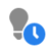

# Icono Glosario {#new-icon-glossary}

A continuación se muestran los iconos de la nueva interfaz de Adobe Marketo Engage. Si necesita hacer referencia a los iconos de Marketo Classic, pueden ser [se encuentra aquí](/help/marketo/getting-started/classic-icon-glossary.md).

## Iconos generales {#general-icons}

<table> 
 <tbody>
  <tr>
   <th>Icono antiguo</th> 
   <th> Icono Nuevo</th> 
   <th>Descripción</th> 
  </tr>
  <tr>
   <td><strong>n/a</strong></td> 
   <td></td> 
   <td>Lista inteligente de cuentas</td> 
  </tr>
  <tr>
   <td></td> 
   <td></td> 
   <td>Campaña por lotes: activa</td> 
  </tr>
  <tr>
   <td></td> 
   <td></td> 
   <td>Campaña por lotes: inactiva</td> 
  </tr>
  <tr>
   <td></td> 
   <td></td> 
   <td>Programa predeterminado</td> 
  </tr>
  <tr>
   <td></td> 
   <td></td> 
   <td>Email</td> 
  </tr>
  <tr>
   <td></td>
   <td></td> 
   <td>Programa de emails</td> 
  </tr>
  <tr>
   <td></td> 
   <td></td> 
   <td>Plantilla de email</td> 
  </tr>
  <tr>
   <td></td> 
   <td></td> 
   <td>Programa de participación</td> 
  </tr>
  <tr>
   <td></td> 
   <td></td> 
   <td>Programa de evento</td> 
  </tr>
  <tr>
   <td></td> 
   <td></td> 
   <td>Campaña ejecutable</td> 
  </tr>
  <tr>
   <td></td> 
   <td></td> 
   <td>Organizador de campos</td> 
  </tr>
  <tr>
   <td></td> 
   <td></td> 
   <td>Filtro</td> 
  </tr>
  <tr>
   <td><strong>n.a</strong></td> 
   <td></td> 
   <td>Filtro: activo</td> 
  </tr>
  <tr>
   <td></td> 
   <td></td> 
   <td>Carpeta</td> 
  </tr>
  <tr>
   <td></td> 
   <td></td> 
   <td>Carpeta: archivada</td> 
  </tr>
  <tr>
   <td></td> 
   <td></td> 
   <td>Carpeta - bloqueada</td> 
  </tr>
  <tr>
   <td></td> 
   <td></td> 
   <td>Formulario</td> 
  </tr>
  <tr>
   <td></td> 
   <td></td> 
   <td>Imágenes (y archivos)</td> 
  </tr>
  <tr>
   <td></td> 
   <td></td> 
   <td>Mensajes dentro de la aplicación</td> 
  </tr>
  <tr>
   <td></td> 
   <td></td> 
   <td>Programa en la aplicación</td> 
  </tr>
  <tr>
   <td></td> 
   <td></td> 
   <td>Página de aterrizaje</td> 
  </tr>
  <tr>
   <td></td> 
   <td></td> 
   <td>Plantilla de la página de destino</td> 
  </tr>
  <tr>
   <td></td> 
   <td></td> 
   <td>Modelo</td> 
  </tr>
  <tr>
   <td></td> 
   <td></td> 
   <td>Sondeo</td> 
  </tr>
  <tr>
   <td></td> 
   <td></td> 
   <td>Notificación de inserción</td> 
  </tr>
  <tr>
   <td></td> 
   <td></td> 
   <td>Oferta recomendada</td> 
  </tr>
  <tr>
   <td></td> 
   <td></td> 
   <td>Informe</td> 
  </tr>
  <tr>
   <td><strong>n.a</strong></td> 
   <td></td> 
   <td>Buscar</td> 
  </tr>
  <tr>
   <td></td> 
   <td></td> 
   <td>Segmentos</td> 
  </tr>
  <tr>
   <td></td> 
   <td></td> 
   <td>Lista inteligente</td> 
  </tr>
  <tr>
   <td></td> 
   <td></td> 
   <td>Lista inteligente: en caché</td> 
  </tr>
  <tr>
   <td></td> 
   <td></td> 
   <td>Mensaje SMS</td> 
  </tr>
  <tr>
   <td></td> 
   <td></td> 
   <td>Fragmentos</td> 
  </tr>
  <tr>
   <td></td> 
   <td></td> 
   <td>Botón social</td> 
  </tr>
  <tr>
   <td></td> 
   <td></td> 
   <td>Lista estática</td> 
  </tr>
  <tr>
   <td></td> 
   <td></td> 
   <td>Sorteos</td> 
  </tr>
  <tr>
   <td></td> 
   <td></td> 
   <td>Grupo de prueba</td> 
  </tr>
  <tr>
   <td></td> 
   <td></td> 
   <td>Déclencheur - activo</td> 
  </tr>
  <tr>
   <td><strong>n.a</strong></td> 
   <td></td> 
   <td>Déclencheur - inactivo</td> 
  </tr>
  <tr>
   <td></td> 
   <td></td> 
   <td>Espacio de trabajo</td> 
  </tr>
  <tr>
   <td></td> 
   <td></td> 
   <td>Video de YouTube</td> 
  </tr>
 </tbody>
</table>

## Campañas por lotes {#batch-campaigns}

<table> 
 <tbody>
  <tr>
   <th>Icono antiguo</th> 
   <th> Icono Nuevo</th> 
   <th>Descripción</th> 
  </tr>
  <tr>
   <td></td> 
   <td></td> 
   <td>Se ha ejecutado, no hay eventos próximos</td> 
  </tr>
  <tr>
   <td></td> 
   <td></td> 
   <td>No válido</td> 
  </tr>
  <tr>
   <td></td> 
   <td></td> 
   <td>No ejecutar nunca</td> 
  </tr>
  <tr>
   <td></td> 
   <td></td> 
   <td>En ejecución, en paso de espera</td> 
  </tr>
  <tr>
   <td></td> 
   <td></td> 
   <td>Programado para ejecutarse</td> 
  </tr>
  <tr>
   <td></td> 
   <td></td> 
   <td>Programado para ejecutarse de nuevo</td> 
  </tr>
  <tr>
   <td></td> 
   <td></td> 
   <td>Utilizado por Nurture</td> 
  </tr>
 </tbody>
</table>

## Campañas desencadenadoras {#trigger-campaigns}

<table> 
 <tbody>
  <tr>
   <th>Icono antiguo</th> 
   <th> Icono Nuevo</th> 
   <th>Descripción</th> 
  </tr>
  <tr>
   <td></td> 
   <td></td> 
   <td>Activo</td> 
  </tr>
  <tr>
   <td></td> 
   <td></td> 
   <td>Se solicita</td> 
  </tr>
  <tr>
   <td><strong>n.a</strong></td> 
   <td></td> 
   <td>Inactivo</td> 
  </tr>
  <tr>
   <td></td> 
   <td></td> 
   <td>No válido</td> 
  </tr>
 </tbody>
</table>

## Programas de email {#email-programs}

<table> 
 <tbody>
  <tr>
   <th>Icono antiguo</th> 
   <th> Icono Nuevo</th> 
   <th>Descripción</th> 
  </tr>
  <tr>
   <td></td> 
   <td></td> 
   <td>Anulado</td> 
  </tr>
  <tr>
   <td></td> 
   <td></td> 
   <td>Completado</td> 
  </tr>
  <tr>
   <td></td> 
   <td></td> 
   <td>No está aprobado</td> 
  </tr>
  <tr>
   <td></td> 
   <td></td> 
   <td>Programado</td> 
  </tr>
 </tbody>
</table>

## Programas de participación {#engagement-programs}

<table> 
 <tbody>
  <tr>
   <th>Icono antiguo</th> 
   <th> Icono Nuevo</th> 
   <th>Descripción</th> 
  </tr>
  <tr>
   <td></td> 
   <td></td> 
   <td>Desactivado</td> 
  </tr>
  <tr>
   <td></td> 
   <td></td> 
   <td>Activado</td> 
  </tr>
 </tbody>
</table>

## Programas dentro de la aplicación {#in-app-programs}

<table> 
 <tbody>
  <tr>
   <th>Icono antiguo</th> 
   <th> Icono Nuevo</th> 
   <th>Descripción</th> 
  </tr>
  <tr>
   <td></td> 
   <td></td> 
   <td>Aprobado</td> 
  </tr>
  <tr>
   <td></td> 
   <td></td> 
   <td>Not Configured Yet</td> 
  </tr>
  <tr>
   <td></td> 
   <td></td> 
   <td>En pausa</td> 
  </tr>
  <tr>
   <td><strong>n.a</strong></td> 
   <td></td> 
   <td>Programado</td> 
  </tr>
  <tr>
   <td></td> 
   <td></td> 
   <td>Detenido</td> 
  </tr>
 </tbody>
</table>

## Recursos {#assets}

<table> 
 <tbody>
  <tr>
   <th>Icono antiguo</th> 
   <th> Icono Nuevo</th> 
   <th>Descripción</th> 
  </tr>
  <tr>
   <td></td> 
   <td></td> 
   <td>Aprobado</td> 
  </tr>
  <tr>
   <td></td> 
   <td></td> 
   <td>Borrador</td> 
  </tr>
  <tr>
   <td></td> 
   <td></td> 
   <td>Aprobado con borrador</td> 
  </tr>
 </tbody>
</table>

## Segmentos {#segments}

<table> 
 <tbody>
  <tr>
   <th>Icono antiguo</th> 
   <th> Icono Nuevo</th> 
   <th>Descripción</th> 
  </tr>
  <tr>
   <td><strong>n.a</strong></td> 
   <td></td> 
   <td>Aprobado - en cálculo</td> 
  </tr>
  <tr>
   <td><strong>n.a</strong></td> 
   <td></td> 
   <td>Aprobado: en proceso de nuevo cálculo</td> 
  </tr>
  <tr>
   <td><strong>n.a</strong></td> 
   <td></td> 
   <td>Borrador en curso de cálculo</td> 
  </tr>
 </tbody>
</table>
