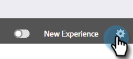

# Conmutador de conmutación {#toggle-switch}

El conmutador de alternancia le permite alternar entre la interfaz clásica de Marketo y el UX moderno. Está disponible en todas las áreas resaltadas a continuación.

>[!NOTE]
>
>Cuando se selecciona el conmutador de alternancia, todos los flujos de trabajo existentes se guardan automáticamente antes de que se produzca el cambio de interfaz de usuario. Si una operación ya está en curso (por ejemplo, si un recurso está en proceso de aprobación), recibirá un mensaje de error que lo indicará e inténtelo de nuevo una vez completada la operación.

## Habilitar el conmutador de alternancia para roles individuales {#enable-the-toggle-switch-for-individual-roles}

Habilite el conmutador de alternancia para roles individuales o todos los roles. Así es como.

1. En Marketo Engage, haga clic en **Administrador**.

   

1. Haga clic en **Nueva experiencia**.

   

1. Seleccione los roles a los que desea conceder acceso con el conmutador.

   

## Habilitar para funciones {#enable-for-features}

Tiene la opción de habilitar manualmente el UX moderno de Marketo Engage para funciones individuales o todas las funciones disponibles (actuales y futuras).

En un área que tenga actualmente el conmutador de alternancia (en este ejemplo estamos en la vista de lista de correo electrónico), simplemente haga clic en el conmutador en la parte inferior derecha de la página.

Se cargará la nueva experiencia.

Para habilitarlo para _todas las_ características, haga clic en el icono de engranaje situado junto al conmutador.

Seleccione **Habilitar para todas las características disponibles** y haga clic en **Aceptar**.

## Características disponibles {#available-features}

Las siguientes funciones están disponibles actualmente en el UX moderno (con nuevas funciones añadidas en cada versión):

* Vista de detalles de correo electrónico
* Vista de lista de correo electrónico
* Vista de detalles de plantilla de correo electrónico
* Lista de plantillas de correo electrónico
* Vista del panel de prueba de correo electrónico
* Vista de detalles del formulario
* Vista de lista de formularios
* Página de detalles de imágenes y archivos
* Vista de detalles de página de aterrizaje
* Vista de lista de página de aterrizaje
* Detalles de plantilla de página de aterrizaje
* Lista de plantillas de página de aterrizaje
* Vista de detalles del fragmento
* Vista de lista de fragmentos

