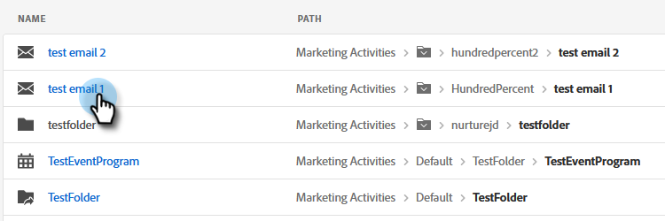

# Uso de la búsqueda global {#using-the-global-search}

La potente búsqueda global le ofrece muchas opciones sin límite en los resultados mostrados.

## Realización de una búsqueda {#performing-a-search}

1. En Navegación global, haga clic en el icono de búsqueda.

   

1. Escriba el texto de identificación del recurso.

   

1. Aparecen los resultados de la búsqueda. Puede hacer clic en cualquier lugar de cualquiera de las rutas de exploración para llevarlas directamente a ese elemento.

   

1. En este ejemplo, elegimos que nos lleven directamente al correo electrónico que estamos buscando. Haga clic en el nombre del correo electrónico.

   

Se le redirige directamente al correo electrónico deseado.

## Página de resultados de búsqueda {#search-results-page}

<table> 
 <tbody>
  <tr>
   <td>1</td> 
   <td>Nombre del elemento/destino</td> 
  </tr>
  <tr>
   <td>2</td> 
   <td>Ruta (rutas de exploración) al elemento/destino respectivo</td> 
  </tr>
  <tr>
   <td>3</td> 
   <td>Fecha y hora de la última modificación del elemento/destino</td> 
  </tr>
  <tr>
   <td>4</td> 
   <td>Fecha y hora de creación del elemento/destino</td> 
  </tr>
  <tr>
   <td>5</td> 
   <td>Implementar filtros centrados para reducir los resultados de búsqueda</td> 
  </tr>
 </tbody>
</table>

**PASO OPCIONAL**: Para utilizar el filtrado, simplemente seleccione las opciones que desee.

