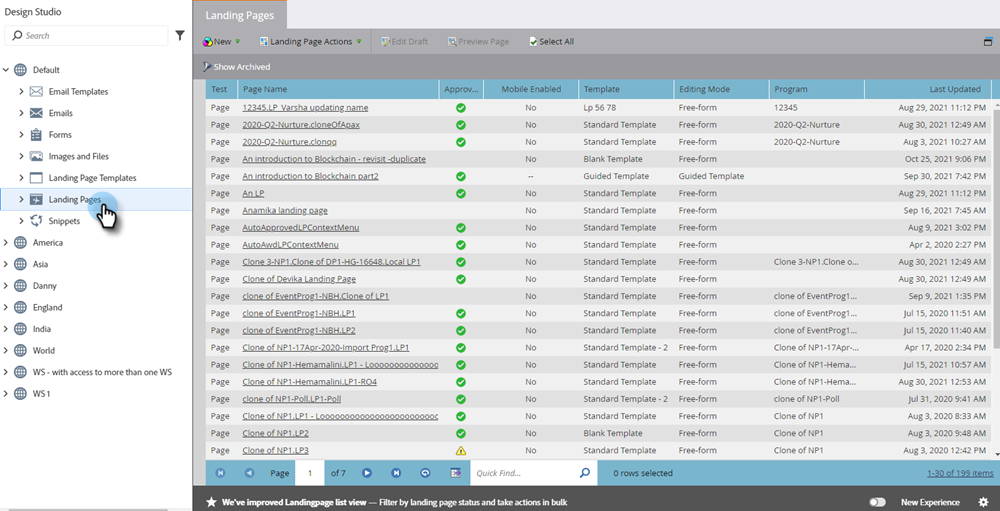

# Alternar conmutador {#toggle-switch}

El conmutador permite cambiar entre la interfaz clásica de Marketo y la nueva experiencia de Marketo Engage de próxima generación. Está disponible en la vista de lista de páginas de aterrizaje y en las páginas de detalles del formulario.

>[!NOTE]
>
>Cuando se selecciona el conmutador, todos los flujos de trabajo existentes se guardan automáticamente antes de que se produzca el cambio en la interfaz de usuario. Si una operación ya está en curso (por ejemplo: un recurso está en proceso de aprobación), recibirá un mensaje de error que lo indicará como tal y debe intentarlo de nuevo una vez completada la operación.

## Vista de lista de páginas de aterrizaje {#landing-page-list-view}

En Marketo, seleccione **Design Studio**.

Select **Páginas de aterrizaje**.

En la parte inferior derecha de la página, haga clic en la **Nueva experiencia** alternar.

Se cargará la nueva experiencia.

>[!NOTE]
>
>La nueva vista de lista de páginas de aterrizaje ofrece filtros de búsqueda y la capacidad de realizar acciones masivas de página de aterrizaje.

## Página Detalles del formulario {#form-details-page}

En Marketo, busque y seleccione el formulario.

En la parte inferior derecha de la página, haga clic en la **Nueva experiencia** alternar.

Se cargará la nueva experiencia.

## Habilitar para todas las funciones {#enable-for-all-features}

Tiene la opción de activar la interfaz de próxima generación de Marketo para todas las funciones disponibles, actuales y futuras.

En un área que actualmente tiene el conmutador (en este ejemplo estamos en [Página Detalles del formulario](#form-details-page)), haga clic en el icono de engranaje en la parte inferior derecha de la página.

Select **Habilitar para todas las funciones disponibles** y haga clic en **OK**.

