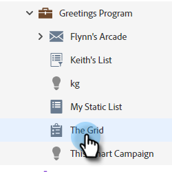
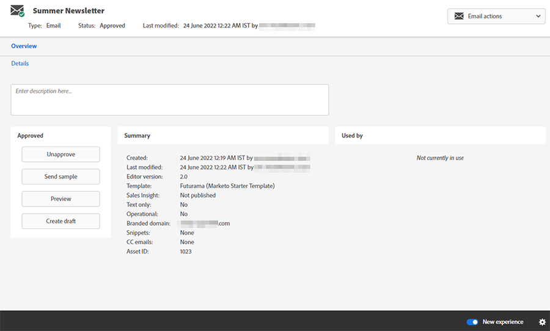
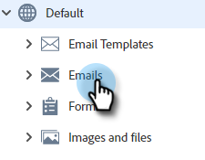

# Alternar conmutador {#toggle-switch}

El conmutador permite cambiar entre la interfaz clásica de Marketo y la experiencia de Marketo Engage de próxima generación. Está disponible en todas las áreas resaltadas a continuación. A partir de la versión de mayo de 2022, la experiencia de próxima generación se habilitará de forma predeterminada.

>[!NOTE]
>
>Cuando se selecciona el conmutador, todos los flujos de trabajo existentes se guardan automáticamente antes de que se produzca el cambio en la interfaz de usuario. Si una operación ya está en curso (por ejemplo: un recurso está en proceso de aprobación), recibirá un mensaje de error que lo indicará como tal y debe intentarlo de nuevo una vez completada la operación.

## Habilitar el conmutador de alternancia para roles individuales {#enable-the-toggle-switch-for-individual-roles}

Active el conmutador para roles individuales o todos los roles. Así es como.

1. En el Marketo Engage, haga clic en **Administrador**.

   

1. Haga clic en **Nueva experiencia**.

   

1. Seleccione las funciones a las que desea tener acceso en el conmutador.

   

## Vista de lista de páginas de aterrizaje {#landing-page-list-view}

La vista de lista de la página de aterrizaje de próxima generación ofrece filtros de búsqueda y la capacidad de realizar acciones masivas de la página de aterrizaje.

1. En Marketo, seleccione **Design Studio**.

   

1. Select **Páginas de aterrizaje**.

   

1. En la parte inferior derecha de la página, haga clic en la **Nueva experiencia** alternar.

   

Se cargará la nueva experiencia.

## Vista de detalles de la página de aterrizaje {#landing-page-details-view}

1. En Marketo, busque y seleccione la página de aterrizaje.

   

1. En la parte inferior derecha de la página, haga clic en la **Nueva experiencia** alternar.

   

Se cargará la nueva experiencia.

## Página Detalles del formulario {#form-details-page}

1. En Marketo, busque y seleccione el formulario.

   

1. En la parte inferior derecha de la página, haga clic en la **Nueva experiencia** alternar.

   

Se cargará la nueva experiencia.

## Vista de lista de formularios {#form-list-view}

1. En Marketo, seleccione **Design Studio**.

   

1. Select **Forms**.

   

1. En la parte inferior derecha de la página, haga clic en la **Nueva experiencia** alternar.

   

Se cargará la nueva experiencia.

## Vista Detalles de plantilla de correo electrónico {#email-template-details-view}

1. En Marketo, seleccione **Design Studio**.

   

1. Seleccione la plantilla de correo electrónico que desee.

   

1. En la parte inferior derecha de la página, haga clic en la **Nueva experiencia** alternar.

   

Se cargará la nueva experiencia.

## Vista Detalles del correo electrónico {#email-details-view}

1. En Marketo, busque y seleccione su correo electrónico.

   

1. En la parte inferior derecha de la página, haga clic en la **Nueva experiencia** alternar.

   

Se cargará la nueva experiencia.

## Vista de lista de correo electrónico {#email-list-view}

La vista de lista de correo electrónico de última generación ofrece filtros de búsqueda y la capacidad de realizar acciones masivas de correo electrónico.

1. En Marketo, seleccione **Design Studio**.

   

1. Select **Correos electrónicos**.

   

1. En la parte inferior derecha de la página, haga clic en la **Nueva experiencia** alternar.

   

Se cargará la nueva experiencia.

## Habilitar para todas las funciones {#enable-for-all-features}

Tiene la opción de habilitar manualmente la interfaz de próxima generación de Marketo para todas las funciones disponibles, actuales y futuras.

1. En un área que actualmente tiene el conmutador (en este ejemplo estamos en [Página Detalles del formulario](#form-details-page)), haga clic en el icono de engranaje en la parte inferior derecha de la página.

   

1. Select **Habilitar para todas las funciones disponibles** y haga clic en **OK**.

   
