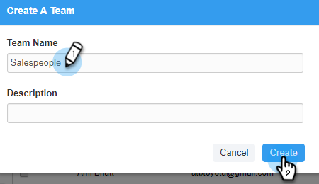
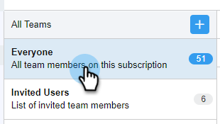

# Crear un subequipo {#create-a-sub-team}

## Crear un subequipo {#create-a-sub-team-1}

1. Haga clic en el icono del engranaje y seleccione **Configuración**.

   

1. En Configuración de administración, seleccione **Administración de equipos**.

   

1. Al lado de Todos los equipos, haga clic en la **+**.

   

1. Introduzca un nombre de equipo (y una descripción opcional) y haga clic en **Crear**.

   

   >[!NOTE]
   >
   >Ahora puede compartir plantillas, campañas y grupos con ese equipo.

## Agregar personas al subequipo {#add-people-to-your-sub-team}

1. En Administración de equipos, seleccione la opción **Todos** grupo.

   

1. Busque los usuarios que desee agregar al subequipo y seleccione su casilla de verificación.

   

1. Haga clic en **Agregar seleccionados a equipos**.

   

1. Haga clic en la lista desplegable y seleccione los equipos que desee.

   

1. Haga clic en **Agregar A Equipos** cuando haya terminado.

   
