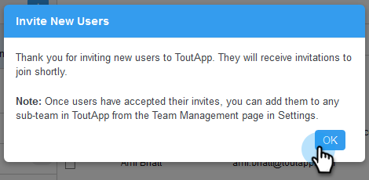

# Invitar a usuarios {#invite-users}

Añadir usuarios es rápido y sencillo.

1. Haga clic en el icono del engranaje y seleccione **[!UICONTROL Configuración]**.

   

1. En [!UICONTROL Configuración de administración], seleccione **[!UICONTROL Administración de usuarios]**.

   

1. Haga clic en **[!UICONTROL Invitar usuarios]**.

   

1. Escriba las direcciones de correo electrónico de las personas que desee agregar y haga clic en **[!UICONTROL Siguiente]**.

   

   >[!NOTE]
   >
   >De forma predeterminada, todos los miembros nuevos se agregarán al equipo Todos.

1. Haga clic en **[!UICONTROL Aceptar]**.

   
