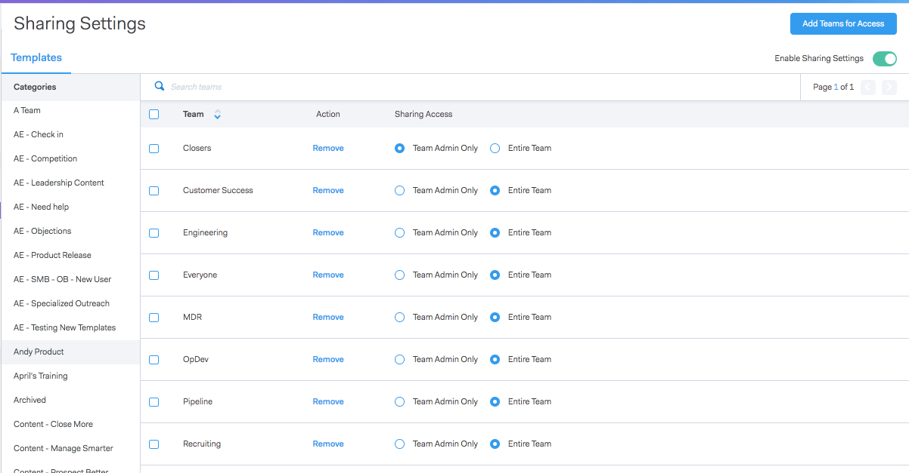

# Configuración para compartir {#sharing-settings}

Administre mejor sus plantillas restringiendo lo que los usuarios pueden compartir y con qué categorías.

La primera vez que se cree la cuenta de Sales Connect, se habilitarán [!UICONTROL Configuraciones de uso compartido]. Esto ofrece a los administradores de su cuenta la oportunidad de crear y organizar las categorías de plantilla antes de abrir las puertas y permitir a los usuarios compartir contenido en las categorías de equipo.

Cuando [!UICONTROL Configuración de uso compartido] está habilitada, solamente los administradores podrán compartir en categorías a menos que se proporcionen privilegios de uso compartido a un equipo o a todos. Con [!UICONTROL Configuración de uso compartido] deshabilitada, no hay restricciones y todos los usuarios pueden compartir en cualquier categoría de plantilla.

## Configurar la configuración de uso compartido {#configure-your-sharing-settings}

1. En la [aplicación web](https://toutapp.com/login), vaya a la página [!UICONTROL Configuración].

   

1. En [!UICONTROL Configuración de administración], seleccione **[!UICONTROL Acceso compartido]**.

   

1. Asegúrese de que **[!UICONTROL Configuración de uso compartido]** esté habilitada. Esto significa que, de forma predeterminada, solo los administradores podrán compartir plantillas en las categorías de plantillas.

   

1. Seleccione la Categoría de plantilla que desee configurar.

   

1. Haga clic en **[!UICONTROL Agregar equipos para obtener acceso]**.

   

1. Seleccione los equipos que desee añadir.

   

   >[!NOTE]
   >
   >Si no ve ningún equipo, tendrá que ir a Administración de equipos y crear un equipo de usuarios.

1. Haga clic en **[!UICONTROL Agregar equipos para obtener acceso]** para guardar.

   

1. Ahora que se ha añadido su equipo, puede seleccionar permitir que solo los administradores de equipo compartan información sobre todos los usuarios de ese equipo. En este ejemplo, dimos acceso compartido a todos los usuarios del equipo de SDR.

   
