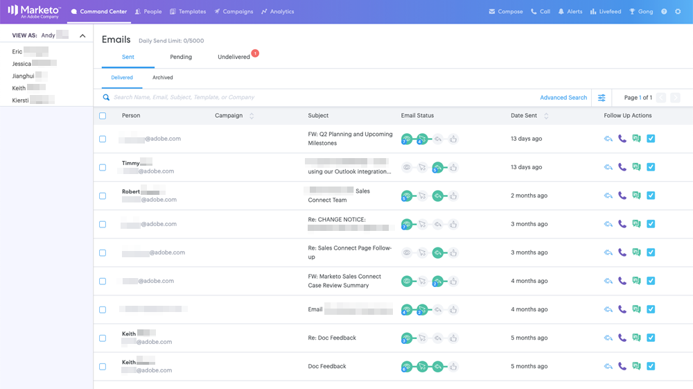

# Detalles de acceso de usuario {#user-access-details}

¿A qué tienen acceso los administradores y no administradores?

## Permisos de usuario del administrador {#admin-user-permissions}

Los administradores pueden [ver todas las plantillas](/help/marketo/product-docs/marketo-sales-connect/templates/view-template-list-as-another-user.md).

Los administradores pueden [ver todas las campañas](/help/marketo/product-docs/marketo-sales-connect/campaigns/view-campaigns-list-as-another-user.md).

Los administradores pueden ver toda la actividad de correo electrónico.

Los administradores pueden ver todas las personas en una campaña en ejecución.

Se puede acceder a todos los registros de personas en el grupo Todos .

Los administradores pueden detener las campañas en nombre de los usuarios.

## Permisos de usuario que no son administradores {#non-admin-user-permissions}

* Análisis:

   * Los usuarios pueden ver análisis de equipo
   * Los usuarios solo pueden explorar en profundidad los equipos a los que pertenecen
   * Los usuarios pueden ver sus propios análisis

* Página Relaciones:

   * Los usuarios pueden compartir grupos con todos
   * Los usuarios pueden compartir grupos solo con los equipos a los que pertenecen
   * Cuando se elimina un usuario, sus contactos compartidos transfieren la propiedad al administrador maestro que eliminó al usuario

* Beat de ventas - Siguiente y Fuente activa:

   * Los usuarios pueden ver la vista &quot;todos&quot;
   * Los usuarios pueden filtrar por los equipos a los que pertenecen
   * El usuario puede compartir publicaciones con todos
   * Los usuarios pueden compartir anuncios solo con los equipos a los que pertenecen

* Página Administración de equipos:

   * No se puede ver

* Página Plantillas:

   * Los usuarios pueden compartir plantillas con todos
   * Los usuarios pueden compartir plantillas en las categorías que sus administradores les permiten
   * Cuando se elimina un usuario de un equipo, sus plantillas se dejan de compartir con ese equipo
   * Cuando se elimina un usuario de un equipo, sus plantillas transfieren la propiedad al administrador maestro que eliminó el usuario
