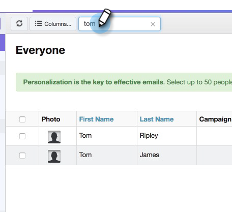
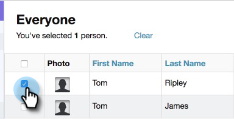
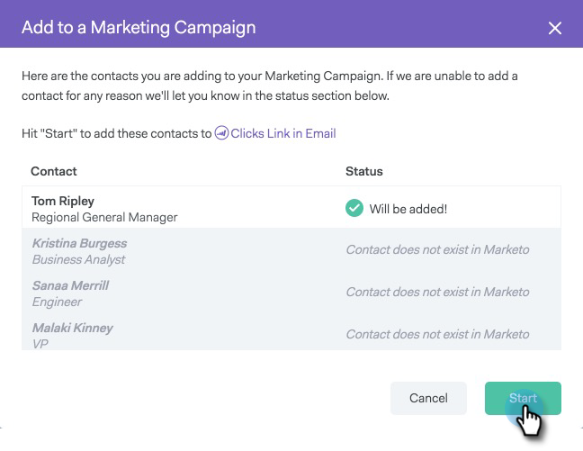
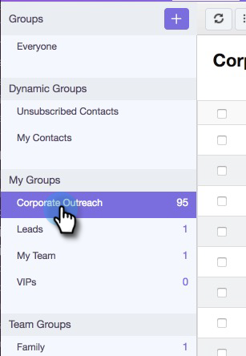
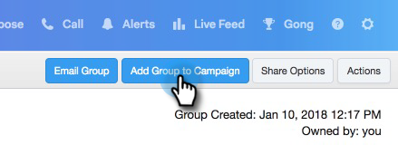

# Añadir a campaña de marketing {#add-to-marketing-campaign}

>[!PREREQUISITES]
>
>[Hacer que una campaña sea visible para los usuarios de ventas](/help/marketo/product-docs/marketo-sales-connect/marketo/make-a-campaign-visible-to-sales-connect-users.md)

## Adición de particulares a una campaña {#add-individuals-to-a-campaign}

>[!NOTE]
>
>Para agregar una persona a una campaña de Marketo desde [!DNL Sales Connect], [!DNL Sales Connect] debe tener el ID de posible cliente de Marketo de la persona.

1. Haga clic en la ficha **[!UICONTROL Personas]**.

   

1. Busque los contactos que desea agregar.

   

1. Haga clic en la casilla de verificación para seleccionar los contactos.

   

1. Haga clic en **[!UICONTROL Agregar selección a campaña]**.

   

1. Dado que está añadiendo a una campaña de marketing, omita seleccionar una dirección &quot;de&quot;. Sin embargo, puedes elegir añadir más contactos. Si lo desea, haga clic en **[!UICONTROL Individuos]** y escríbalos. Haga clic en **[!UICONTROL Siguiente]** cuando haya terminado.

   

1. Haga clic en **[!UICONTROL Campaña de marketing]**.

   

1. Haga clic en el menú desplegable [!UICONTROL Espacios de trabajo] y elija el espacio de trabajo que contiene la campaña a la que desea agregar el grupo.

   

   >[!NOTE]
   >
   >Si no ve el espacio de trabajo que desea, asegúrese de que el administrador lo aprovisione a través de la página de Marketo Team Access.

1. Seleccione la campaña que desee y haga clic en **[!UICONTROL Siguiente]**.

   

1. Se muestran los contactos que cumplen los requisitos. Haga clic en **[!UICONTROL Iniciar]** para que se agreguen.

   

## Añadir un grupo a una campaña {#add-a-group-to-a-campaign}

1. Haga clic en la ficha **[!UICONTROL Personas]**.

   

1. En [!UICONTROL Mis grupos], seleccione el grupo que desee agregar a una campaña.

   

1. Haga clic en **[!UICONTROL Agregar grupo a Campaign]**.

   

1. Dado que está añadiendo a una campaña de marketing, omita seleccionar una dirección &quot;de&quot;. Sin embargo, puedes elegir añadir más contactos. Si lo desea, haga clic en **[!UICONTROL Individuos]** y escríbalos. Haga clic en **[!UICONTROL Siguiente]** cuando haya terminado.

   

1. Seleccione **[!UICONTROL Campaña de marketing]**.

   

   >[!NOTE]
   >
   >Para agregar a una persona a Marketo Campaign desde [!UICONTROL Sales Connect], [!UICONTROL Sales Connect] debe tener el ID de posible cliente de Marketo de la persona.

1. Haga clic en el menú desplegable **[!UICONTROL Espacios de trabajo]** y elija el espacio de trabajo que contiene la campaña a la que desea agregar el grupo.

   

   >[!NOTE]
   >
   >Si no ve el espacio de trabajo que desea, asegúrese de que el administrador lo aprovisione a través de la página de Marketo Team Access.

1. Seleccione la campaña que desee y haga clic en **[!UICONTROL Siguiente]**.

   

1. Se muestran los contactos que cumplen los requisitos. Haga clic en **[!UICONTROL Iniciar]** para que se agreguen.

   
