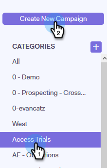
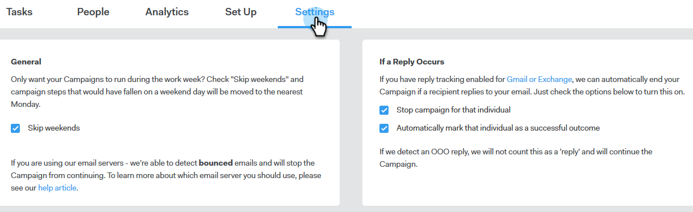

# Creación de una campaña {#create-a-campaign}

Las campañas son una serie de pasos multicanal que incluyen correos electrónicos, llamadas telefónicas, InMail y tareas personalizadas. Permiten optimizar las comunicaciones con los clientes potenciales y existentes.

Con Campañas puede:

* **Organizar**: Optimice todas sus actividades de divulgación en un solo lugar para una ejecución eficiente.

* **Escalar**: programa todos tus esfuerzos de alcance para escalar tus esfuerzos, minimizar el trabajo manual y personalizar tanto como necesites.
* **Medida**: realiza un seguimiento del éxito de todos tus correos electrónicos y tareas en un solo lugar mientras los inicias sesión automáticamente en Salesforce. Sabiendo lo que está resonando y conduciendo a resultados, usted puede probar y mejorar consistentemente sus resultados.

Entonces, ¿cómo se configura una campaña?

1. Haga clic en la ficha **Campañas**.

   

1. Seleccione una categoría y haga clic en el botón **Crear una campaña** para crear una nueva campaña.

   

   >[!NOTE]
   >
   >Para crear una categoría nueva, haz clic en **+** junto a **Categorías**.

1. Se seleccionará la categoría que haya elegido. Si cambia de opinión, haga clic en la lista desplegable y seleccione otra diferente. Cuando haya terminado, haga clic en **Continuar**.

   

1. Haga clic en **Agregar paso**.

   

1. Elija entre: Correo electrónico, Llamada, InMail o Tarea personalizada. En este ejemplo elegimos [Correo electrónico](/help/marketo/product-docs/marketo-sales-connect/campaigns/campaign-step-types.md#email).

   

1. Después de crear su primer día y paso, el botón &quot;Añadir un día&quot; se activa y puede añadir tantos días y pasos como requiera su proceso de ventas.

   

   >[!NOTE]
   >
   >&quot;Días&quot; no es el número de días entre acciones, sino el día dentro de la secuencia. Por ejemplo, si la campaña va a durar 7 días, si escribe &quot;3&quot; significa que la acción se cerrará el día 3 de 7, **no** 3 días después.

1. Asegúrate de personalizar las opciones de programación y respuesta, como omitir los fines de semana (lo que es genial). Para ello, visita la **pestaña Configuración** de tu campaña.

   

   Ahora es el momento de empezar a añadir personas a su campaña.
