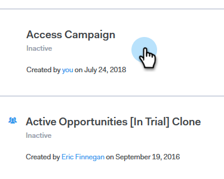

# Omitir fines de semana {#skip-weekends}

Al automatizar una campaña, probablemente no quiera que sus correos electrónicos salgan los sábados o domingos. Si no es así, puede omitir los fines de semana.

1. En Sales Connect, haga clic en la ficha **Campañas**.

   

1. Busque y seleccione su campaña.

   

1. Haga clic en **Configuración**.

   

1. Seleccione la casilla **Omitir fines de semana**.

   

   >[!NOTE]
   >
   >Sin omitir los fines de semana, los correos electrónicos se programan en función de una semana normal de 7 días.
