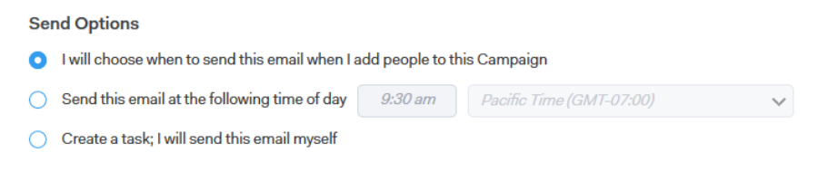

# Explicación de las opciones de envío {#understanding-send-options}

Al crear una Campaña, dispone de varias opciones para crear los pasos de correo electrónico en Sales Connect. Además, según el lugar en el que el correo electrónico se encuentre en la Campaña, las opciones también difieren.

Si es el primer paso y el primer día de la Campaña, tendrá las siguientes opciones:

Elegiré cuándo enviar este correo electrónico

* Esta opción le permite elegir la hora de &quot;envío&quot; para el primer correo electrónico de la Campaña cuando se inicia la Campaña agregando personas.

Enviar este mensaje de correo electrónico a la hora siguiente

* Cuando inicies tu Campaña agregando gente a ella, programaremos el correo electrónico para este momento.
* Siempre tienes la opción de elegir un nuevo &quot;envío&quot; cuando inicies tu Campaña.

Crear una tarea; Yo mismo enviaré este correo electrónico

* Esta opción creará una Tarea por correo electrónico (y sincronizará con Salesforce) que podrá enviar a su conveniencia.
* Una vez que haya realizado esta selección, al iniciar la Campaña, pondremos estas tareas en la cola para usted en el Centro de comandos y en la fuente en vivo. A continuación, puede personalizar y enviar (o programar) cada correo electrónico antes de que salga.

   * Si abre esta tarea en nuestra aplicación web, se abrirá una ventana de composición con la dirección de correo electrónico de su contacto, la línea de asunto de su correo electrónico y la plantilla que ha elegido.
   * Si abre esta tarea en Gmail o Outlook, se abrirá una ventana de composición nativa y se rellenará dinámicamente la dirección de correo electrónico del contacto, la línea de asunto del correo electrónico y la plantilla que elija.

Para los días o pasos subsiguientes de la Campaña, tendrá las siguientes opciones:

Enviar este correo electrónico al mismo tiempo que el correo electrónico anterior de esta Campaña

* Esta opción enviará el mensaje de correo electrónico al mismo tiempo que el correo electrónico que se le ha enviado directamente.
* Seguirá enviándose el día en que esté asociado.

Enviar este mensaje de correo electrónico a la hora siguiente

* Cuando inicies tu Campaña agregando gente a ella, programaremos el correo electrónico para este momento.
* Siempre tienes la opción de elegir un nuevo &quot;envío&quot; cuando inicies tu Campaña.

Crear una tarea; Yo mismo enviaré este correo electrónico

* Esta opción creará una Tarea por correo electrónico (y sincronizará con Salesforce) que podrá enviar a su conveniencia.
* Una vez que haya realizado esta selección, cuando inicie la Campaña, Tout colocará estas tareas en la cola para usted en el Centro de comandos y en la Fuente en vivo. A continuación, puede personalizar y enviar (o programar) cada correo electrónico antes de que salga.

   * Si abre esta tarea en nuestra aplicación web, se abrirá una ventana de composición con la dirección de correo electrónico de su contacto, la línea de asunto de su correo electrónico y la plantilla que ha elegido.
   * Si abre esta tarea en Gmail o Outlook, se abrirá una ventana de composición nativa y se rellenará dinámicamente la dirección de correo electrónico del contacto, la línea de asunto del correo electrónico y la plantilla que elija.

Envía este correo electrónico al correo electrónico anterior

* Esta opción de envío será un &#39;seguimiento&#39; del correo electrónico anterior y anexará el cuerpo del correo anterior a la parte inferior de este mensaje.
