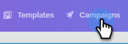

# Ver la lista de campañas como otro usuario {#view-campaigns-list-as-another-user}

Como administrador, puede ver las campañas como cualquier usuario.

>[!NOTE]
>
>**Se requieren permisos de administración**

1. En la aplicación web, haga clic en **[!UICONTROL Campañas]**.

   

1. Haga clic en el menú desplegable **[!UICONTROL Ver como]** y seleccione el usuario que desee.

   

1. Ahora está viendo las campañas como el usuario seleccionado.

   

   >[!NOTE]
   >
   >También puede utilizar filtros o la función de búsqueda junto con Ver como para ver qué es lo más relevante para usted.
