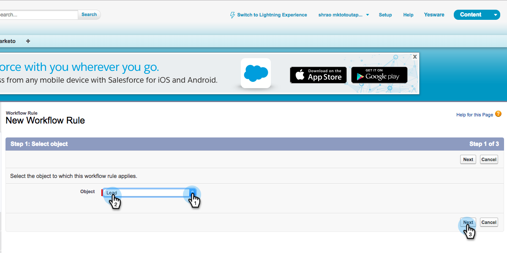

# Creación de reglas de flujo de trabajo en Salesforce {#creating-workflow-rules-in-salesforce}

Al usar Marketo Sales Insight (MSI) y Marketo Sales Connect (MSC) en paralelo, la función Más probable de MSI de [!DNL Salesforce] no se actualizará. Todas las demás funciones de MSI funcionan de la forma habitual (ver momentos interesantes en el iFrame, enviar correos electrónicos, añadir a campañas, etc.). Este artículo ofrece una solución para que los resultados más probables vuelvan a funcionar.

>[!NOTE]
>
>Esto solo afecta a los clientes que usan **tanto** MSI como MSE, y que desean usar la característica Lo mejor en MSI. Si no necesita ni utiliza los resultados más probables, puede hacer caso omiso de.

## Introducción {#getting-started}

La solución incluye la creación de nuevas reglas de flujo de trabajo para copiar valores de los nuevos campos MSE en los antiguos campos MSI. Deberá crear cuatro reglas de flujo de trabajo para el objeto Contacto y las mismas cuatro reglas de flujo de trabajo para el objeto Posible cliente en su propia instancia de [!DNL Salesforce]. Esto puede requerir que tenga derechos de administración de CRM (según su función y configuración en CRM).

A continuación se muestran los nombres recomendados de las reglas de flujo de trabajo y la descripción de cada una. Esto se aplica al objeto [!UICONTROL Contact] y [!UICONTROL Lead]:

<table>
 <colgroup>
  <col>
  <col>
 </colgroup>
 <tbody>
  <tr>
   <td>Actualizar Campo Desc De Momento Interesante</td>
   <td>
Copiar de: Última descripción de Marketo Engagement Copiar en: Último momento interesante Desc
</td>
  </tr>
  <tr>
   <td>Actualizar campo de tipo de momento interesante</td>
   <td>
Copiar de: Último tipo de participación de Marketo Copiar en: Último tipo de momento interesante
</td>
  </tr>
  <tr>
   <td>Actualizar campo de Source de momento interesante</td>
   <td>
Copiar de: Último Source de Marketo Engagement Copiar en: Último momento interesante Source
</td>
  </tr>
  <tr>
   <td>Actualizar campo Fecha de momento interesante</td>
   <td>
Copiar de: Fecha de la última participación de Marketo Copiar a: Fecha del último momento interesante
</td>
  </tr>
 </tbody>
</table>

## Instrucciones {#instructions}

1. Después de hacer clic en **[!UICONTROL Configuración]**, busque **Flujo de trabajo** y seleccione **[!UICONTROL Reglas de flujo de trabajo]**.

   

1. Seleccione **[!UICONTROL Nueva regla]**.

   

1. Haga clic en el menú desplegable [!UICONTROL Objeto], seleccione **[!UICONTROL Posible cliente]** y luego haga clic en **[!UICONTROL Siguiente]**.

   

1. Escriba &quot;Actualizar campo de descripción de momento interesante&quot; como [!UICONTROL nombre de regla]. Seleccione el botón de opción **[!UICONTROL creado y cada vez que se edite]**. En la lista desplegable [!UICONTROL Criterios de regla], seleccione **[!UICONTROL la fórmula se evalúa como verdadera]**. Busque y seleccione la función ISCHANGED. A continuación, resalte el valor de campo predeterminado y haga clic en **[!UICONTROL Insertar campo]**.

   

1. En el elemento emergente &quot;[!UICONTROL Insertar campo]&quot;, elija **[!UICONTROL Último Desc. de participación de Marketo]** y haga clic en **[!UICONTROL Insertar]**.

   

1. Haga clic en **[!UICONTROL Guardar y siguiente]**.

   

1. En el menú desplegable [!UICONTROL Agregar acción de flujo de trabajo], seleccione **[!UICONTROL Nueva actualización de campo]**.

   

1. En el campo [!UICONTROL Nombre], escriba &quot;Actualizar campo de descripción de momento interesante&quot; ([!UICONTROL Nombre único] se generará automáticamente). En el menú desplegable [!UICONTROL Campo para actualizar], elija **[!UICONTROL Último momento interesante Desc]**. Seleccione el botón de opción **[!UICONTROL Usar una fórmula para establecer un nuevo valor]** y, a continuación, haga clic en **[!UICONTROL Mostrar editor de fórmulas]**.

   

1. Haga clic en el botón **[!UICONTROL Insertar campo]**.

   

1. Seleccione **[!UICONTROL Última descripción de Marketo Engagement]** y haga clic en **[!UICONTROL Insertar]**. En la página siguiente, haz clic en **[!UICONTROL Guardar]**.

   

1. Haga clic en **[!UICONTROL Finalizado]**.

   

1. Haga clic en **[!UICONTROL Activar]** para activar la regla de flujo de trabajo.

   

   Después del último paso, puede optar por clonar la regla de flujo de trabajo para los demás campos enumerados en la sección [!UICONTROL Introducción]: Desc, Type, Source, Date. Después de completar las cuatro reglas de flujo de trabajo del objeto [!UICONTROL Contact], repita lo mismo con el objeto [!UICONTROL Lead].
