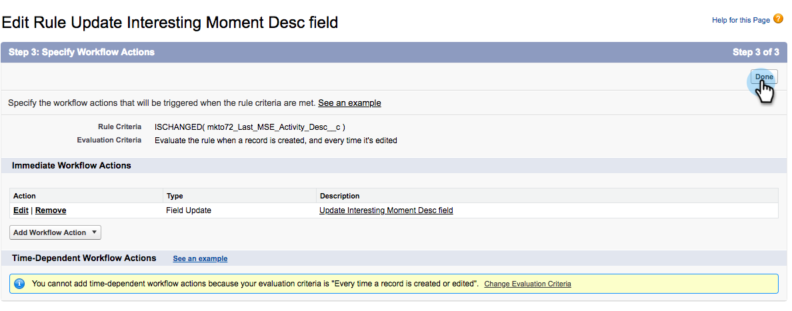

# Creación de reglas de flujo de trabajo en Salesforce {#creating-workflow-rules-in-salesforce}

Cuando se utiliza Marketo Sales Insight (MSI) y Marketo Sales Connect (MSC) en paralelo, la función MSI Best Bets de Salesforce no se actualiza. El resto de las funciones de MSI funcionan de la forma habitual (ver momentos interesantes en el iFrame, enviar correos electrónicos, agregar campañas, etc.). Este artículo ofrece una solución alternativa para que Best Bets vuelva a funcionar.

>[!NOTE]
>
>Esto solo afecta a los clientes que utilizan **both** MSI y MSE, y que desean utilizar la función Best Bets en MSI. Si no necesita/utiliza Best Bets, puede ignorar.

## Introducción {#getting-started}

La solución incluye la creación de nuevas reglas de flujo de trabajo para copiar valores de nuevos campos MSE en los campos MSI antiguos. Deberá crear cuatro reglas de flujo de trabajo para el objeto Contact y las mismas cuatro reglas de flujo de trabajo para el objeto Lead en su propia instancia de Salesforce. Esto puede requerir que tenga derechos de administrador de CRM (según su función y configuración en CRM).

A continuación se muestran los nombres recomendados de las reglas de flujo de trabajo y la descripción de cada una. Se aplican al objeto Contact and Lead :

<table> 
 <colgroup> 
  <col> 
  <col> 
 </colgroup> 
 <tbody> 
  <tr> 
   <td>Actualizar el campo Desc de momento interesante</td> 
   <td>
Copiar desde: Última descripción de participación de Marketo Copiar a: Último momento interesante Desc
</td> 
  </tr> 
  <tr> 
   <td>Actualizar el campo Tipo de momento interesante</td> 
   <td>
Copiar desde: Último tipo de participación en Marketo Copiar a: Último tipo de momento interesante
</td> 
  </tr> 
  <tr> 
   <td>Actualizar el campo de origen de momento interesante</td> 
   <td>
Copiar desde: Última fuente de participación de Marketo Copiar a: Última fuente de momento interesante
</td> 
  </tr> 
  <tr> 
   <td>Actualizar el campo Fecha de momento interesante</td> 
   <td>
Copiar desde: Fecha de la última participación en Marketo Copiar a: Última fecha de momento interesante
</td> 
  </tr> 
 </tbody> 
</table>

## Instrucciones {#instructions}

1. Después de hacer clic en **Configuración**, busque **Flujo de trabajo** y seleccione **Reglas de flujo de trabajo**.

   

1. Select **Nueva regla**.

   

1. Haga clic en la lista desplegable Objeto y seleccione **Posible cliente** y haga clic en **Siguiente**.

   

1. Introduzca &quot;Actualizar el campo Desc de Momento Interesante&quot; como Nombre de Regla. Seleccione el botón de radio **creado y cada vez que se edita**. En la lista desplegable Criterios de regla , seleccione **formula se evalúa como verdadero**. Busque y seleccione la función ISCHANGED . A continuación, resalte el valor predeterminado del campo y haga clic en **Insertar campo**.

   

1. En la ventana emergente &quot;Insertar campo&quot;, seleccione **Última descripción de participación de Marketo** y haga clic en **Insertar**.

   

1. Haga clic en **Guardar y siguiente**.

   

1. En la lista desplegable Agregar acción de flujo de trabajo , seleccione **Actualización de campo nuevo**.

   

1. En el campo Nombre, introduzca &quot;Actualizar campo de descripción de momento interesante&quot; (el nombre único se generará automáticamente). En la lista desplegable Campo para actualizar , elija **Último momento interesante Desc**. Seleccione el **Utilizar una fórmula para establecer un nuevo valor** botón de radio y, a continuación, haga clic en **Mostrar editor de fórmulas**.

   

1. Haga clic en el **Insertar campo** botón.

   

1. Select **Última descripción de participación de Marketo** y haga clic en **Insertar**. En la página siguiente, haga clic en **Guardar**.

   

1. Haga clic en **Listo**.

   

1. Haga clic en **Activar** para activar la regla de flujo de trabajo.

   

   Después del último paso, puede elegir clonar la regla de flujo de trabajo para los demás campos que aparecen en la sección Introducción : Desc, Tipo, Origen, Fecha. Después de completar las cuatro reglas de flujo de trabajo en el objeto Contact , repita lo mismo para el objeto Lead .
