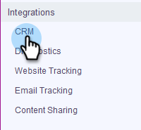
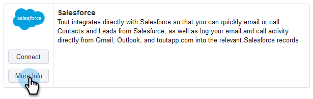
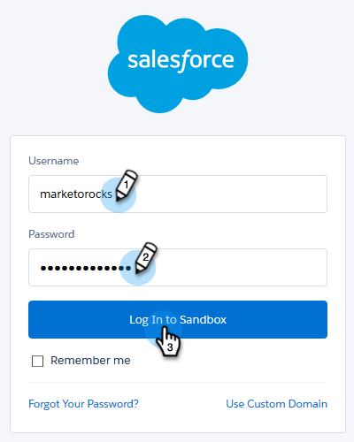

# Cómo conectar Sales Connect a su zona protegida de Salesforce {#how-to-connect-sales-connect-to-your-salesforce-sandbox}

>[!PREREQUISITES]
>
>Su cuenta de [!DNL &#x200B; Sales Connect] no puede estar conectada a [!DNL Salesforce] al establecer una conexión con la zona protegida. Si es así, [asegúrese de desconectar](/help/marketo/product-docs/marketo-sales-connect/crm/salesforce-integration/disconnect-salesforce-from-your-sales-connect-account.md) antes de seguir los pasos de este artículo.

1. En [!DNL Sales Connect], haga clic en el icono de engranaje en la esquina superior derecha y seleccione **[!UICONTROL Configuración]**.

   

1. En [!UICONTROL Integraciones], haga clic en **[!UICONTROL CRM]**.

   

1. En la tarjeta [!DNL Salesforce], haga clic en **[!UICONTROL Más información]**.

   

1. En la parte inferior de la página, haz clic en **[!UICONTROL Conectarse a espacio aislado]**.

   

   >[!NOTE]
   >
   >Si ya inició sesión en su cuenta de [!DNL Salesforce Sandbox], se le redirigirá a una página Autorización en la que deberá permitir el acceso. Si aún no ha iniciado sesión, continúe con el paso 5.

1. Escriba el nombre de usuario y la contraseña de su cuenta de [!DNL Salesforce Sandbox].

   

>[!MORELIKETHIS]
>
>[Cómo instalar personalizaciones en su espacio aislado de Salesforce](/help/marketo/product-docs/marketo-sales-connect/crm/salesforce-customization/how-to-install-customizations-in-your-salesforce-sandbox.md)
