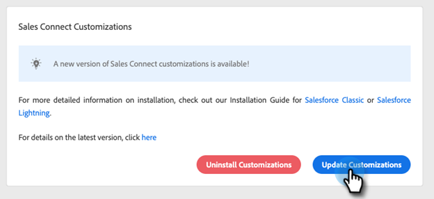

# Personalizaciones de Conexión de Ventas para CRM {#sales-connect-customizations-for-crm}

La API de metadatos de Salesforce CRM crea los campos y botones siguientes. Una vez creados los campos, los administradores deben configurar los diseños de página en su CRM para exponerlos. Se pueden encontrar instrucciones [here](https://docs.marketo.com/display/docs/assets/marketo-sales-engage-for-salesforce-installation-and-success-guide.pdf).

>[!NOTE]
>
>Esto afecta tanto a los clientes de ToutApp como a los de Sales Connect.

## Instalación de personalizaciones en Salesforce {#how-to-install-customizations-in-salesforce}

1. En Conexión de ventas, haga clic en el icono de engranaje y seleccione **Configuración**.

   

1. En Configuración de administración, seleccione **Salesforce**.

   

1. Haga clic en **Personalizaciones de Marketo Sales Connect**.

   

1. Haga clic en **Conectarse a Salesforce**.

   

1. Inicie sesión en Salesforce.

   

## Actualizar la personalización de Salesforce {#update-salesforce-customization}

Las actualizaciones del paquete Personalización de Salesforce incluirán mejoras y correcciones de errores. Para comprobar si hay actualizaciones disponibles o para realizar una actualización, siga los pasos a continuación.

>[!NOTE]
>
>**Se requieren permisos de administrador.**

1. En el [aplicación web](https://www.toutapp.com), haga clic en el icono del engranaje y seleccione **Configuración**.

   

1. En Configuración de administración, haga clic en **Salesforce**.

   

1. La tarjeta de personalización de Conexión de ventas mostrará si hay actualizaciones disponibles. Haga clic en **Actualizar personalizaciones**.

   

1. Haga clic en **Actualización**.

   

1. Espere a que se instalen las actualizaciones. Dependiendo de cuántos números de versión necesite, el tiempo de instalación variará.

   

Una vez finalizada, la tarjeta mostrará &quot;Las personalizaciones de Sales Connect están actualizadas&quot;.

## Campos de actividad personalizados {#custom-activity-fields}

Marketo detectará la creación de los nuevos campos y, a continuación, realizará un rellenado único de datos, una reasignación y una sincronización continua de valores en la variable **new** solo campos. Los campos antiguos no se actualizarán.

| **Nombre del campo** | **Descripción** |
|---|---|
| ID de presencia local de llamada MSE | Como usuario, puede elegir la presencia local como opción cuando realiza llamadas desde el teléfono MSE. Las llamadas entrantes mostrarán un número local para el receptor. |
| URL de registro de llamada MSE | Las llamadas se pueden registrar y un enlace para la grabación se registrará aquí. |
| Campaña MSE | Registra el nombre de la campaña MSE de la que es miembro el contacto/posible cliente. |
| URL de campaña de MSE | Registra la dirección URL de la campaña creada en MSE. Al hacer clic en esto, se abrirá la campaña en la aplicación web MSE. |
| Etapa actual de la campaña MSE | Si un contacto/posible cliente es parte de una campaña, este campo registrará el nombre del paso en el que se encuentra el contacto/posible cliente. |
| Archivos adjuntos de correo electrónico de MSE vistos | Registra los datos cuando se envía un correo electrónico con un archivo adjunto y el destinatario lo ve. |
| Correo electrónico de MSE en el que se hizo clic | Registra una marca de verificación cuando el destinatario hace clic en un vínculo de un correo electrónico. |
| Correo electrónico de MSE respondido | Registra una marca de verificación cuando el destinatario responde a un correo electrónico. |
| Estado de correo electrónico de MSE | Muestra si se envía/está en curso/si se devuelve un correo electrónico (el seguimiento de los correos electrónicos devueltos depende del canal de envío utilizado). |
| Plantilla de correo electrónico MSE | Nombre de registro de la plantilla MSE que se utilizó en el correo electrónico enviado al posible cliente o contacto. |
| URL de plantilla de correo electrónico MSE | Registra la dirección URL de la plantilla creada en MSE. Al hacer clic en esto, se abrirá la plantilla en la aplicación web MSE. |
| URL de correo electrónico de MSE | Al hacer clic en esta URL, se abrirá el Centro de comandos en MSE y se abrirá la pestaña del historial de vista de detalles de personas , donde podrá ver el correo electrónico enviado. |
| Correo electrónico de MSE visto | Registra una marca de verificación cuando el destinatario ve un correo electrónico. |

## Campos de registro resumidos {#roll-up-logging-fields}

<table> 
 <colgroup> 
  <col> 
  <col> 
 </colgroup> 
 <tbody> 
  <tr> 
   <td><strong>Nombre del campo</strong></td> 
   <td><strong>Descripción</strong></td> 
  </tr> 
  <tr> 
   <td>MSE: último compromiso de marketing</td> 
   <td>Última participación entrante de Marketing. </td> 
  </tr> 
  <tr> 
   <td>MSE - Última fecha de compromiso de marketing</td> 
   <td>Marca de tiempo de la participación de Marketing.</td> 
  </tr> 
  <tr> 
   <td>MSE - Última descripción de participación de marketing</td> 
   <td>Descripción de la participación.</td> 
  </tr> 
  <tr> 
   <td>MSE - Última fuente de participación en marketing</td> 
   <td>Fuente de la participación de Marketing.</td> 
  </tr> 
  <tr> 
   <td colspan="1">MSE - Último tipo de compromiso de marketing</td> 
   <td colspan="1">Tipo de participación.</td> 
  </tr> 
  <tr> 
   <td colspan="1">MSE - Última actividad por ventas </td> 
   <td colspan="1">Última actividad saliente realizada por el equipo de ventas.</td> 
  </tr> 
  <tr> 
   <td colspan="1">MSE - Última respuesta</td> 
   <td colspan="1">Última respuesta de correo electrónico al correo electrónico de ventas.</td> 
  </tr> 
  <tr> 
   <td colspan="1">MSE - Campaña de ventas actual</td> 
   <td colspan="1">Registra el nombre de la campaña de MSE a la que pertenece el posible cliente o contacto.</td> 
  </tr> 
  <tr> 
   <td colspan="1">MSE: último compromiso de ventas</td> 
   <td colspan="1">Última contratación entrante de Ventas. </td> 
  </tr> 
  <tr> 
   <td colspan="1">MSE: exclusión</td> 
   <td colspan="1">Campo de exclusión.</td> 
  </tr> 
 </tbody> 
</table>

## Botones {#buttons}

| **Nombre del botón** | **Descripción** |
|---|---|
| Enviar correo electrónico MSE | Enviar correos electrónicos de ventas desde Salesforce. |
| Añadir a MSE Campaign | Agregue a las campañas MSE desde Salesforce. |
| Insertar en MSE | Insertar contacto de Salesforce a MSE. |
| Llame a con MSE | Realizar llamadas de ventas desde Salesforce. |

## Botones de acción masiva {#bulk-action-buttons}

| **Nombre del botón** | **Descripción** |
|---|---|
| Añadir a MSE Campaign | Agregue a las campañas MSE desde Salesforce. |
| Insertar en MSE | Insertar contacto de Salesforce a MSE. |

## Guías del usuario {#user-guides}

[Informes personalizados de MSE en Salesforce](https://docs.marketo.com/display/docs/assets/mse-custom-reports-in-sf.docx)

[MSE para Salesforce](https://docs.marketo.com/display/docs/assets/mse-for-sf-classic.pdf)

[MSE para Salesforce Lightning](https://s3.amazonaws.com/tout-user-store/salesforce/assets/SF+Guide+for+Lightning.pdf)
