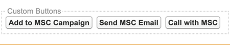
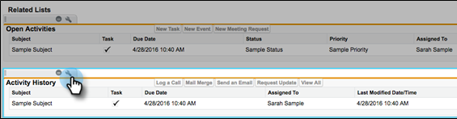
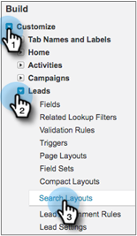

# Desinstalar Marketo Sales Connect desde Salesforce Classic {#uninstall-marketo-sales-connect-from-salesforce-classic}

A continuación se indica cómo desinstalar el paquete de Marketo Sales Connect de su cuenta de Salesforce una vez que comience a utilizar las acciones de Sales Insight.

## Quitar [!DNL Sales Connect] campos del diseño de página {#remove-sales-connect-fields-from-page-layout}

1. En [!DNL Salesforce] Classic, haga clic en **[!UICONTROL Configurar]**.

   

1. En la barra de navegación izquierda, debajo de [!UICONTROL Generar], expanda (pero no haga clic) [!UICONTROL Personalizar] y luego [!UICONTROL Posibles clientes]. Seleccione **[!UICONTROL Diseños de página]**.

   

1. Haga clic en **[!UICONTROL Editar]** junto al diseño del posible cliente.

   

1. En la consola, seleccione **[!UICONTROL Campos]**. En Búsqueda rápida, busque &quot;MSC&quot;. Todos los campos atenuados se han agregado al diseño de página. Tendrá que eliminarlos. - ¿Por qué?

   

   >[!NOTE]
   >
   >Si ninguno de los campos está deshabilitado, significa que no los ha agregado al diseño de página. Puede omitir esta sección.

1. Desplácese hasta la sección que tenga sus [!DNL Sales Connect] campos personalizados.

   

1. Existen 10 tipos de campos MSC que se pueden agregar a esta sección. Elimine todos los campos que ha añadido o simplemente elimine toda la sección.

1. Haga clic en **[!UICONTROL Guardar rápidamente]** cuando haya terminado.

   

## Quitar botones [!DNL Sales Connect] de los diseños de página {#remove-sales-connect-buttons-from-page-layouts}

1. En la consola (paso 4 anterior), seleccione **[!UICONTROL Botones]**. Buscar &quot;MSC&quot;. Todos los botones atenuados se han agregado a la sección de botones personalizados. Tendrá que eliminarlos. - ¿Por qué?

   

   >[!NOTE]
   >
   >Si ninguno de los botones está deshabilitado, significa que no los ha agregado. Puede omitir esta sección.

1. Arrastre y suelte los botones MSC de la sección [!UICONTROL Botones personalizados] en la consola.

   

1. Haga clic en **[!UICONTROL Guardar rápidamente]** cuando haya terminado.

   

## Quitar [!DNL Sales Connect] campos de la sección [!UICONTROL Historial de actividades] {#remove-sales-connect-fields-from-activity-history-section}

1. Desplácese hasta la parte inferior de la página a la sección de lista relacionada con el [!UICONTROL Historial de actividades] y haga clic en el icono de la llave inglesa.

   

1. Seleccione los [!DNL Sales Connect] campos del área [!UICONTROL Campos seleccionados] y haga clic en la flecha [!UICONTROL Quitar]. Haga clic en **[!UICONTROL Aceptar]** cuando haya terminado.

   

   >[!NOTE]
   >
   >La abreviatura MSE _es_ [!DNL Sales Connect]. Es solo el nombre anterior, &quot;Marketo Sales Engage&quot;.

1. Haz clic en **Guardar** cuando termines de usar la página de posibles clientes.

## Eliminar [!DNL Sales Connect] botones de acción masiva de la vista de lista de posibles clientes {#remove-sales-connect-bulk-action-buttons-from-lead-list-view}

1. En la barra de navegación izquierda, debajo de [!UICONTROL Generar], expanda (pero no haga clic) [!UICONTROL Personalizar] y luego [!UICONTROL Posibles clientes]. A continuación, seleccione **[!UICONTROL Buscar diseños]**.

   

1. Junto a Vista de lista de posibles clientes, haga clic en **[!UICONTROL Editar]**.

   

1. Seleccione **[!UICONTROL Agregar a MSC Campaign (Classic)]**, **[!UICONTROL Enviar correo electrónico con MSC (Classic)]** y **[!UICONTROL Insertar en MSC (Classic)]**, y haga clic en la flecha [!UICONTROL Quitar]. Luego haz clic en **[!UICONTROL Guardar]**.

   

Ya no debería ver los botones en la vista de lista de posibles clientes.

## Quitar la configuración de MSC para contactos {#remove-msc-configuration-for-contacts}

1. En [!DNL Salesforce], haga clic en **[!UICONTROL Configuración]**.

1. En la barra de navegación izquierda, debajo de [!UICONTROL Generar], expanda (pero no haga clic) [!UICONTROL Personalizar] y luego [!UICONTROL Contactos]. Seleccione **[!UICONTROL Diseños de página]**.

1. Junto a Diseño de contacto, haga clic en **[!UICONTROL Editar]**.

1. Repita los pasos de las tres secciones.

## Quitar la configuración de MSC para la oportunidad {#remove-msc-configuration-for-opportunity}

1. En [!DNL Salesforce], haga clic en **[!UICONTROL Configuración]**.

1. En la barra de navegación izquierda, debajo de [!UICONTROL Generar], expanda (pero no haga clic) [!UICONTROL Personalizar] y luego [!UICONTROL Oportunidades]. Seleccione **[!UICONTROL Diseños de página]**.

1. Junto a Diseño de oportunidad, haga clic en **[!UICONTROL Editar]**.

1. Repita los pasos de las tres secciones.

La vista de oportunidad solo tiene un botón: &quot;Enviar correo electrónico MSE&quot; y los siguientes campos:

## Quitar la configuración MSC de la cuenta {#remove-msc-configuration-for-account}

1. En [!DNL Salesforce], haga clic en **[!UICONTROL Configuración]**.

1. En la barra de navegación izquierda, debajo de [!UICONTROL Generar], expanda (pero no haga clic) [!UICONTROL Personalizar] y luego [!UICONTROL Cuenta]. Seleccione **[!UICONTROL Diseños de página]**.

1. Junto a Diseño de cuenta, haga clic en **[!UICONTROL Editar]**.

1. Repita los pasos de las tres secciones.

La vista de cuenta solo tiene un botón: &quot;Enviar correo electrónico MSE&quot; y los siguientes campos:

## Quitar bandeja de salida de ventas Marketo {#remove-marketo-sales-outbox}

1. En [!DNL Salesforce], haga clic en la ficha **+** de la parte superior de la pantalla.

1. Haga clic en **[!UICONTROL Personalizar mis fichas]**.

1. Seleccione la opción Marketo Sales Outbox de la derecha. Haga clic en la flecha [!UICONTROL Quitar] y luego haga clic en **[!UICONTROL Guardar]**.

## Eliminar paquete [!DNL Sales Connect] {#delete-sales-connect-package}

Una vez que haya eliminado todos los objetos de su cuenta de Salesforce, siga los pasos a continuación.

1. En [!DNL Salesforce], haga clic en **[!UICONTROL Configuración]**.

1. En el cuadro Búsqueda rápida, escriba &quot;Clases Apex&quot;.

1. Haga clic en **Eliminar** junto a todas las entradas &quot;MarketoSalesConnectionCustomization&quot; o &quot;MarketoSalesEngageCustomization&quot; de la lista.

Ya está todo listo.

Esta es una lista de todos los objetos que deben eliminarse de la instancia de Salesforce:

## Detalles de personalización de [!DNL Sales Connect] {#sales-connect-customization-details}

<table>
 <tr>
  <th>Campos de actividad personalizada</th>
  <th>Descripción</th>
  <th>Tipo</th>
  <th>Tipo de datos</th>
 </tr>
 <tr>
  <td>[!UICONTROL MSC Llamada ID de presencia local]</td>
  <td>Como usuario, puedo elegir la presencia local como opción cuando hago llamadas desde el teléfono MSC. Las llamadas entrantes mostrarán un número local para el receptor</td>
  <td>Actividad</td>
  <td>Texto</td>
 </tr>
 <tr>
  <td>[!UICONTROL MSC URL de grabación de llamadas]</td>
  <td>Las llamadas se pueden grabar y aquí se registrará un vínculo para la grabación </td>
  <td>Actividad</td>
  <td>Texto</td>
 </tr>
 <tr>
  <td>[!UICONTROL MSC Campaign]</td>
  <td>Registra el nombre de la campaña de MSC en la que se encuentra el contacto/posible cliente</td>
  <td>Actividad</td>
  <td>Texto</td>
 </tr>
 <tr>
  <td>[!UICONTROL MSC Campaign URL]</td>
  <td>Registra la URL de la campaña creada en MSC. Al hacer clic en esta opción, se abre la campaña en la aplicación web de MSC</td>
  <td>Actividad</td>
  <td>Texto</td>
 </tr>
 <tr>
  <td>[!UICONTROL MSC Campaign Paso actual]</td>
  <td>Si un contacto/posible cliente está en una campaña, este campo registrará el nombre del paso en el que se encuentra actualmente</td>
  <td>Actividad</td>
  <td>Casilla de verificación</td>
 </tr>
 <tr>
  <td>[!UICONTROL MSC Email Attachment Visto]</td>
  <td>Registra datos cuando se envía un correo electrónico con un archivo adjunto que ve el destinatario</td>
  <td>Actividad</td>
  <td>Casilla de verificación</td>
 </tr>
 <tr>
  <td>[!UICONTROL MSC Correo electrónico en el que se hizo clic]</td>
  <td>Registra una marca de verificación cuando el destinatario hace clic en un vínculo del correo electrónico</td>
  <td>Actividad</td>
  <td>Casilla de verificación</td>
 </tr>
 <tr>
  <td>[!UICONTROL MSC Correo electrónico respondido]</td>
  <td>Registra una marca de verificación cuando el destinatario responde al correo electrónico</td>
  <td>Actividad</td>
  <td>Texto</td>
 </tr>
 <tr>
  <td>[!UICONTROL Estado de correo electrónico MSC]</td>
  <td>Muestra si un correo electrónico se envía/está en curso/se rechaza (el seguimiento de los correos electrónicos rechazados depende del canal de envío utilizado)</td>
  <td>Actividad</td>
  <td>Texto</td>
 </tr>
 <tr>
  <td>[!UICONTROL Plantilla de correo electrónico MSC]</td>
  <td>Registra el nombre de la plantilla de MSC que se utilizó en el correo electrónico enviado al posible cliente/contacto</td>
  <td>Actividad</td>
  <td>Texto</td>
 </tr>
 <tr>
  <td>[!UICONTROL MSC Email Template URL]</td>
  <td>Registra la URL de la plantilla creada en MSC. Al hacer clic en esta opción, se abrirá la plantilla en la aplicación web de MSC</td>
  <td>Actividad</td>
  <td>Texto</td>
 </tr>
 <tr>
  <td>[!UICONTROL MSC Email URL]</td>
  <td>Al hacer clic en esta URL, se abrirá el centro de comandos en MSC y se abrirá la pestaña Historial de vista de detalles de personas, donde el usuario puede ver el correo electrónico enviado</td>
  <td>Actividad</td>
  <td>Texto</td>
 </tr>
 <tr>
  <td>[!UICONTROL MSC Correo electrónico visto]</td>
  <td>Registra una marca de verificación cuando el destinatario ve un correo electrónico</td>
  <td>Actividad</td>
  <td>Casilla de verificación</td>
 </tr>
</table>

<table>
 <tr>
  <th>Campo de registro de resumen de MSC</th>
  <th>Descripción</th>
  <th>Tipo</th>
  <th>Tipo de datos</th>
 </tr>
 <tr>
  <td>MSC: última participación de marketing</td>
  <td>Última participación entrante de Marketing</td>
  <td>
  
Cuenta
  
Contacto
  
Posible cliente
  
Oportunidad</td>
  <td>Datos y tiempo</td>
 </tr>
 <tr>
  <td>MSC: fecha del último compromiso de marketing</td>
  <td>Marca de tiempo de la participación del marketing</td>
  <td>
  
Cuenta
  
Contacto
  
Posible cliente
  
Oportunidad</td>
  <td>Datos y tiempo</td>
 </tr>
 <tr>
  <td>MSC: Última descripción de participación de marketing</td>
  <td>Descripción de la participación</td>
  <td>
  
Cuenta
  
Contacto
  
Posible cliente
  
Oportunidad</td>
  <td>Texto</td>
 </tr>
 <tr>
  <td>MSC: Último Source de participación de marketing</td>
  <td>Participación de Source of Marketing</td>
  <td>
  
Cuenta
  
Contacto
  
Posible cliente
  
Oportunidad</td>
  <td>Texto</td>
 </tr>
 <tr>
  <td>MSC: último tipo de participación de marketing</td>
  <td>Tipo de participación (por ejemplo, actividad web)</td>
  <td>
  
Cuenta
  
Contacto
  
Posible cliente
  
Oportunidad</td>
  <td>Texto</td>
 </tr>
 <tr>
  <td>MSC - Última actividad por ventas</td>
  <td>Última actividad saliente realizada por el equipo de ventas</td>
  <td>
  
Cuenta
  
Contacto
  
Posible cliente
  
Oportunidad</td>
  <td>Datos y tiempo</td>
 </tr>
 <tr>
  <td>MSC: última respuesta</td>
  <td>Última respuesta de correo electrónico al correo electrónico de ventas</td>
  <td>
  
Cuenta
  
Contacto
  
Posible cliente
  
Oportunidad</td>
  <td>Datos y tiempo</td>
 </tr>
 <tr>
  <td>MSC: campaña de ventas actual</td>
  <td>Registra el nombre de la campaña de MSC en la que se encuentra el contacto/posible cliente</td>
  <td>
  
Cuenta
  
Contacto
  
Posible cliente
  
Oportunidad</td>
  <td>Texto</td>
 </tr>
 <tr>
  <td>MSC: Último acuerdo de ventas</td>
  <td>Último compromiso entrante de Ventas</td>
  <td>
  
Cuenta
  
Contacto
  
Posible cliente
  
Oportunidad</td>
  <td>Datos y tiempo</td>
 </tr>
 <tr>
  <td>MSC: exclusión</td>
  <td>Campo de exclusión</td>
  <td>
  
Cuenta
  
Contacto
  
Posible cliente
  
Oportunidad</td>
  <td>Casilla de verificación</td>
 </tr>
</table>

<table>
 <tr>
  <th>Botones MSC</th>
  <th>Descripción</th>
  <th>Tipo</th>
 </tr>
 <tr>
  <td>[!UICONTROL Enviar correo electrónico MSC]</td>
  <td>Envío de correos electrónicos de ventas desde [!DNL Salesforce]</td>
  <td>
  
Cuenta
  
Contacto
  
Posible cliente
  
Oportunidad</td>
 </tr>
 <tr>
  <td>[!UICONTROL Agregar a MSC Campaign]</td>
  <td>Añadir a campañas de MSC desde [!DNL Salesforce]</td>
  <td>
  
Contacto
  
Posible cliente</td>
 </tr>
 <tr>
  <td>[!UICONTROL Push to MSC]</td>
  <td>Contacto push de [!DNL Salesforce] a MSC</td>
  <td>
  
Contacto
  
Posible cliente</td>
 </tr>
 <tr>
  <td>Llamada de [!UICONTROL con MSC]</td>
  <td>Realizar llamadas de ventas desde [!DNL Salesforce]</td>
  <td>
  
Contacto
  
Posible cliente</td>
 </tr>
</table>

<table>
 <tr>
  <th>Botones de acción masiva de MSC</th>
  <th>Descripción</th>
  <th>Tipo</th>
 </tr>
 <tr>
  <td>[!UICONTROL Agregar a MSC Campaign (Classic)]</td>
  <td>Añadir a campañas de MSC desde [!DNL Salesforce]</td>
  <td>
  
Contacto
  
Posible cliente</td>
 </tr>
 <tr>
  <td>[!UICONTROL Push to MSC (Classic)]</td>
  <td>Contacto push de [!DNL Salesforce] a MSC</td>
  <td>
  
Contacto
  
Posible cliente</td>
 </tr>
 <tr>
  <td>[!UICONTROL Correo electrónico con MSC (clásico)]</td>
  <td>Correo electrónico con MSC desde [!DNL Salesforce]</td>
  <td>
  
Contacto
  
Posible cliente</td>
 </tr>
</table>
