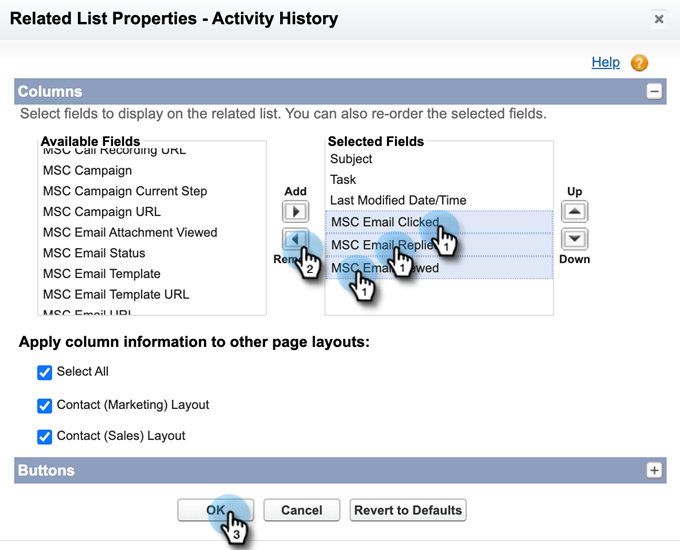
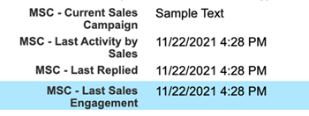

# Desinstalar Marketo Sales Connect desde Salesforce Lightning {#uninstall-marketo-sales-connect-from-salesforce-lightning}

A continuación se indica cómo desinstalar el paquete de Marketo Sales Connect de su cuenta de Salesforce una vez que comience a utilizar las acciones de Sales Insight.

## Eliminar campos de Conexión de ventas del diseño de página {#remove-sales-connect-fields-from-page-layout}

1. En Salesforce Lightning, haz clic en el icono de engranaje y selecciona **Configuración**.

   

1. Haga clic en **Administrador de objetos**.

   

1. Desplácese hacia abajo hasta **Posible cliente** y selecciónelo.

   

1. Haga clic en **Diseños de página**.

   

1. Haga clic en **Diseño de posible cliente**.

   

   >[!NOTE]
   >
   >La vista Editar diseño de página aún no se ha actualizado en Salesforce Lightning.

1. En la consola, seleccione **Campos**. En Búsqueda rápida, busque &quot;MSC&quot;. Todos los campos atenuados se han agregado al diseño de página. Tendrá que eliminarlos. - ¿Por qué?

   

   >[!NOTE]
   >
   >Si ninguno de los campos está deshabilitado, significa que no los ha agregado al diseño de página. Puede omitir esta sección.

1. Desplácese hasta la sección que tenga los campos personalizados de Sales Connect.

   

1. Existen 10 tipos de campos MSC que se pueden agregar a esta sección. Elimine todos los campos que ha añadido o simplemente elimine toda la sección.

1. Haga clic en **Guardar rápidamente** cuando haya terminado.

   

## Eliminar botones de conexión de ventas de los diseños de página {#remove-sales-connect-buttons-from-page-layouts}

1. En la consola (paso 4 anterior), seleccione **Botones**. Buscar &quot;MSC&quot;. Todos los botones atenuados se han agregado a la sección de botones personalizados. Tendrá que eliminarlos. - ¿Por qué?

   

   >[!NOTE]
   >
   >Si ninguno de los botones está deshabilitado, significa que no los ha agregado. Puede omitir esta sección.

1. Arrastre y suelte los botones MSC de la sección Botones personalizados a la consola.

   

1. Haga clic en **Guardar rápidamente** cuando haya terminado.

   

## Eliminar campos de conexión de ventas de la sección Historial de actividades {#remove-sales-connect-fields-from-activity-history-section}

1. Desplácese hasta la parte inferior de la página a la sección de la lista relacionada con el Historial de actividades y haga clic en el icono de la llave inglesa.

   

1. Seleccione los campos de conexión de ventas del área Campos seleccionados y haga clic en la flecha Eliminar. Haga clic en **Aceptar** cuando haya terminado.

   

   >[!NOTE]
   >
   >La abreviatura MSE _es_ Sales Connect. Es solo el nombre anterior, &quot;Marketo Sales Engage&quot;.

1. Haz clic en **Guardar** cuando termines de usar la página de posibles clientes.

## Eliminar botones de acción masiva de conexión de ventas de la vista de lista de posibles clientes {#remove-sales-connect-bulk-action-buttons-from-lead-list-view}

1. En Salesforce Lightning, haz clic en el icono de engranaje y selecciona **Configuración**.

   

1. Haga clic en **Administrador de objetos**.

   

1. Desplácese hacia abajo hasta **Posible cliente** y selecciónelo.

   

1. Haga clic en **Buscar diseños**.

   

1. Haga clic en la flecha situada junto a Vista de lista y seleccione **Editar**.

   

1. Seleccione **Agregar a la campaña de MSC**, **Enviar correo electrónico con MSC** y **Insertar en MSC**, y haga clic en la flecha Eliminar. Luego haz clic en **Guardar**.

   

Ya no debería ver los botones en la vista de lista de posibles clientes.

## Quitar la configuración de MSC para contactos {#remove-msc-configuration-for-contacts}

1. En Salesforce Lightning, haz clic en el icono de engranaje y selecciona **Configuración**.

1. Haga clic en **Administrador de objetos**.

1. Desplácese hacia abajo hasta **Contacto** y selecciónelo.

1. Haga clic en **Diseños de página**.

1. Haga clic en **Diseño de contacto**.

1. Repita los pasos de las tres secciones.

## Quitar la configuración de MSC para la oportunidad {#remove-msc-configuration-for-opportunity}

1. En Salesforce Lightning, haz clic en el icono de engranaje y selecciona **Configuración**.

1. Haga clic en **Administrador de objetos**.

1. Desplácese hacia abajo y seleccione **Oportunidad**.

1. Haga clic en **Diseños de página**.

1. Haga clic en **Diseño de oportunidad**.

La vista de oportunidad solo tiene un botón: &quot;Enviar correo electrónico MSE&quot; y los siguientes campos:

## Quitar la configuración MSC de la cuenta {#remove-msc-configuration-for-account}

1. En Salesforce Lightning, haz clic en el icono de engranaje y selecciona **Configuración**.

1. Haga clic en **Administrador de objetos**.

1. Desplácese hacia abajo y seleccione **Cuenta**.

1. Haga clic en **Diseños de página**.

1. Haga clic en **Diseño de cuenta**.

La vista de cuenta solo tiene un botón: &quot;Enviar correo electrónico MSE&quot; y los siguientes campos:

## Quitar bandeja de salida de ventas Marketo {#remove-marketo-sales-outbox}

1. En Salesforce, haga clic en la ficha **+** de la parte superior de la pantalla.

1. Haga clic en **Personalizar mis fichas**.

1. Seleccione la opción Marketo Sales Outbox de la derecha. Haga clic en la flecha Quitar y luego en **Guardar**.

## Eliminar paquete de Sales Connect {#delete-sales-connect-package}

Una vez que haya eliminado todos los objetos de su cuenta de Salesforce, siga los pasos a continuación.

1. En Salesforce Lightning, haz clic en el icono de engranaje y selecciona **Configuración**.

1. En el cuadro Búsqueda rápida, escriba &quot;Clases Apex&quot;.

1. Haga clic en **Eliminar** junto a todas las entradas &quot;MarketoSalesConnectionCustomization&quot; o &quot;MarketoSalesEngageCustomization&quot; de la lista.

Ya está todo listo.

Esta es una lista de todos los objetos que deben eliminarse de la instancia de Salesforce:

## Detalles de personalización de Sales Connect {#sales-connect-customization-details}

<table>
 <tr>
  <th>Campos de actividad personalizada</th>
  <th>Descripción</th>
  <th>Tipo</th>
  <th>Tipo de datos</th>
 </tr>
 <tr>
  <td>ID de presencia local de llamada MSC</td>
  <td>Como usuario, puedo elegir la presencia local como opción cuando hago llamadas desde el teléfono MSC. Las llamadas entrantes mostrarán un número local para el receptor</td>
  <td>Actividad</td>
  <td>Texto</td>
 </tr>
 <tr>
  <td>URL de grabación de llamadas MSC</td>
  <td>Las llamadas se pueden grabar y aquí se registrará un vínculo para la grabación </td>
  <td>Actividad</td>
  <td>Texto</td>
 </tr>
 <tr>
  <td>Campaña MSC</td>
  <td>Registra el nombre de la campaña de MSC en la que se encuentra el contacto/posible cliente</td>
  <td>Actividad</td>
  <td>Texto</td>
 </tr>
 <tr>
  <td>URL de campaña MSC</td>
  <td>Registra la URL de la campaña creada en MSC. Al hacer clic en esta opción, se abre la campaña en la aplicación web de MSC</td>
  <td>Actividad</td>
  <td>Texto</td>
 </tr>
 <tr>
  <td>Etapa actual de campaña de MSC</td>
  <td>Si un contacto/posible cliente está en una campaña, este campo registrará el nombre del paso en el que se encuentra actualmente</td>
  <td>Actividad</td>
  <td>Casilla de verificación</td>
 </tr>
 <tr>
  <td>Archivos adjuntos de correo electrónico MSC vistos</td>
  <td>Registra datos cuando se envía un correo electrónico con un archivo adjunto que ve el destinatario</td>
  <td>Actividad</td>
  <td>Casilla de verificación</td>
 </tr>
 <tr>
  <td>Correo electrónico MSC pulsado</td>
  <td>Registra una marca de verificación cuando el destinatario hace clic en un vínculo del correo electrónico</td>
  <td>Actividad</td>
  <td>Casilla de verificación</td>
 </tr>
 <tr>
  <td>Correo electrónico MSC respondido</td>
  <td>Registra una marca de verificación cuando el destinatario responde al correo electrónico</td>
  <td>Actividad</td>
  <td>Texto</td>
 </tr>
 <tr>
  <td>Estado de correo electrónico MSC</td>
  <td>Muestra si un correo electrónico se envía/está en curso/se rechaza (el seguimiento de los correos electrónicos rechazados depende del canal de envío utilizado)</td>
  <td>Actividad</td>
  <td>Texto</td>
 </tr>
 <tr>
  <td>Plantilla de correo electrónico MSC</td>
  <td>Registra el nombre de la plantilla de MSC que se utilizó en el correo electrónico enviado al posible cliente/contacto</td>
  <td>Actividad</td>
  <td>Texto</td>
 </tr>
 <tr>
  <td>URL de plantilla de correo electrónico MSC</td>
  <td>Registra la URL de la plantilla creada en MSC. Al hacer clic en esta opción, se abrirá la plantilla en la aplicación web de MSC</td>
  <td>Actividad</td>
  <td>Texto</td>
 </tr>
 <tr>
  <td>URL de correo electrónico MSC</td>
  <td>Al hacer clic en esta URL, se abrirá el centro de comandos en MSC y se abrirá la pestaña Historial de vista de detalles de personas, donde el usuario puede ver el correo electrónico enviado</td>
  <td>Actividad</td>
  <td>Texto</td>
 </tr>
 <tr>
  <td>Correo electrónico MSC visto</td>
  <td>Registra una marca de verificación cuando el destinatario ve un correo electrónico</td>
  <td>Actividad</td>
  <td>Casilla de verificación</td>
 </tr>
</table>

<table>
 <tr>
  <th>Campo de registro de resumen de MSC</th>
  <th>Descripción</th>
  <th>Tipo</th>
  <th>Tipo de datos</th>
 </tr>
 <tr>
  <td>MSC: última participación de marketing</td>
  <td>Última participación entrante de Marketing</td>
  <td>
  
Cuenta
  
Contacto
  
Posible cliente
  
Oportunidad</td>
  <td>Datos y tiempo</td>
 </tr>
 <tr>
  <td>MSC: fecha del último compromiso de marketing</td>
  <td>Marca de tiempo de la participación del marketing</td>
  <td>
  
Cuenta
  
Contacto
  
Posible cliente
  
Oportunidad</td>
  <td>Datos y tiempo</td>
 </tr>
 <tr>
  <td>MSC: Última descripción de participación de marketing</td>
  <td>Descripción de la participación</td>
  <td>
  
Cuenta
  
Contacto
  
Posible cliente
  
Oportunidad</td>
  <td>Texto</td>
 </tr>
 <tr>
  <td>MSC: Último Source de participación de marketing</td>
  <td>Participación de Source of Marketing</td>
  <td>
  
Cuenta
  
Contacto
  
Posible cliente
  
Oportunidad</td>
  <td>Texto</td>
 </tr>
 <tr>
  <td>MSC: último tipo de participación de marketing</td>
  <td>Tipo de participación (por ejemplo, actividad web)</td>
  <td>
  
Cuenta
  
Contacto
  
Posible cliente
  
Oportunidad</td>
  <td>Texto</td>
 </tr>
 <tr>
  <td>MSC - Última actividad por ventas</td>
  <td>Última actividad saliente realizada por el equipo de ventas</td>
  <td>
  
Cuenta
  
Contacto
  
Posible cliente
  
Oportunidad</td>
  <td>Datos y tiempo</td>
 </tr>
 <tr>
  <td>MSC: última respuesta</td>
  <td>Última respuesta de correo electrónico al correo electrónico de ventas</td>
  <td>
  
Cuenta
  
Contacto
  
Posible cliente
  
Oportunidad</td>
  <td>Datos y tiempo</td>
 </tr>
 <tr>
  <td>MSC: campaña de ventas actual</td>
  <td>Registra el nombre de la campaña de MSC en la que se encuentra el contacto/posible cliente</td>
  <td>
  
Cuenta
  
Contacto
  
Posible cliente
  
Oportunidad</td>
  <td>Texto</td>
 </tr>
 <tr>
  <td>MSC: Último acuerdo de ventas</td>
  <td>Último compromiso entrante de Ventas</td>
  <td>
  
Cuenta
  
Contacto
  
Posible cliente
  
Oportunidad</td>
  <td>Datos y tiempo</td>
 </tr>
 <tr>
  <td>MSC: exclusión</td>
  <td>Campo de exclusión</td>
  <td>
  
Cuenta
  
Contacto
  
Posible cliente
  
Oportunidad</td>
  <td>Casilla de verificación</td>
 </tr>
</table>

<table>
 <tr>
  <th>Botones MSC</th>
  <th>Descripción</th>
  <th>Tipo</th>
 </tr>
 <tr>
  <td>Enviar correo electrónico MSC</td>
  <td>Envío de correos electrónicos de ventas desde Salesforce</td>
  <td>
  
Cuenta
  
Contacto
  
Posible cliente
  
Oportunidad</td>
 </tr>
 <tr>
  <td>Añadir a la campaña de MSC</td>
  <td>Añadir a campañas MSC desde Salesforce</td>
  <td>
  
Contacto
  
Posible cliente</td>
 </tr>
 <tr>
  <td>Insertar en MSC</td>
  <td>Contacto push de Salesforce a MSC</td>
  <td>
  
Contacto
  
Posible cliente</td>
 </tr>
 <tr>
  <td>Llamar con MSC</td>
  <td>Realizar llamadas de ventas desde Salesforce</td>
  <td>
  
Contacto
  
Posible cliente</td>
 </tr>
</table>

<table>
 <tr>
  <th>Botones de acción masiva de MSC</th>
  <th>Descripción</th>
  <th>Tipo</th>
 </tr>
 <tr>
  <td>Añadir a la campaña de MSC</td>
  <td>Añadir a campañas MSC desde Salesforce</td>
  <td>
  
Contacto
  
Posible cliente</td>
 </tr>
 <tr>
  <td>Insertar en MSC</td>
  <td>Contacto push de Salesforce a MSC</td>
  <td>
  
Contacto
  
Posible cliente</td>
 </tr>
 <tr>
  <td>Correo electrónico con MSC</td>
  <td>Correo electrónico con MSC de Salesforce</td>
  <td>
  
Contacto
  
Posible cliente</td>
 </tr>
</table>
