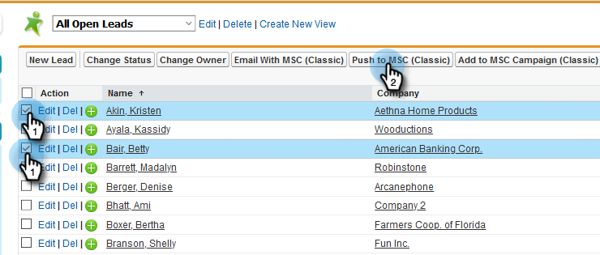

# Uso de acciones masivas en [!DNL Salesforce] Classic {#using-bulk-actions-in-salesforce-classic}

Aprenda a realizar acciones masivas, como agregar posibles clientes a una campaña, enviar un correo electrónico masivo o transferir posibles clientes de [!DNL Salesforce] a [!DNL Sales Connect].

>[!PREREQUISITES]
>
>Actualice a la última versión del paquete [!DNL Sales Connect] e instale los botones de acción masiva en la vista de posibles clientes o contactos. [Haga clic aquí para obtener instrucciones](https://s3.amazonaws.com/tout-user-store/salesforce/assets/Marketo+Sales+Engage+For+Salesforce_+Installation+and+Success+Guide.pdf).

>[!NOTE]
>
>Antes de seguir los pasos descritos anteriormente, asegúrese de haber iniciado sesión en su cuenta de Marketo Sales Connect.

## Correo electrónico masivo {#bulk-email}

1. En [!DNL Salesforce], haga clic en la ficha **[!UICONTROL Posibles clientes]** y luego en el botón **[!UICONTROL Ir]**.

   

1. Elija los posibles clientes que quiera y haga clic en el botón **[!UICONTROL Correo electrónico con MSC (clásico)]**.

   

1. Aparecerá un correo electrónico de MSC. Incluye las siguientes funciones:

   a. El campo &quot;[!UICONTROL Para]&quot; muestra &quot;[!UICONTROL Todos los destinatarios]&quot;, que corresponde a la lista de posibles clientes que ha elegido en la vista de lista de posibles clientes
b. Esta lista está visible en el panel izquierdo llamado &quot;[!UICONTROL Maquetar]&quot;. Puede agregar o quitar destinatarios aquí
c. Puede elegir una plantilla o crear su propio correo electrónico
d. Puede obtener una vista previa de los campos dinámicos que se rellenarán en el correo electrónico
e. Puede enviar el correo electrónico de inmediato o programar su envío más tarde

   

## Agregar a la campaña {#add-to-campaign}

1. En [!DNL Salesforce], haga clic en la ficha **[!UICONTROL Posibles clientes]** y luego en el botón **[!UICONTROL Ir]**.

   

1. Elija los posibles clientes que quiera y haga clic en el botón **[!UICONTROL Agregar a MSC Campaign (Classic)]**.

   

1. Aparecerá la ventana emergente &quot;[!UICONTROL Agregar personas a tu campaña]&quot;. Haga clic en **[!UICONTROL Siguiente]** y siga el flujo de campaña habitual para almacenar en déclencheur una campaña de MSC.

   

## Insertar en Marketo Sales Connect {#push-to-marketo-sales-connect}

1. En [!DNL Salesforce], haga clic en la ficha **[!UICONTROL Posibles clientes]** y luego en el botón **[!UICONTROL Ir]**.

   

1. Elija los posibles clientes que quiera y haga clic en el botón **[!UICONTROL Insertar en MSC (clásico)]**.

   

1. Se abrirá una nueva pestaña llamada &quot;[!UICONTROL Salesforce Bridge]&quot;. Haga clic en el botón **[!UICONTROL Continuar al grupo →]**.

   

1. Se le enviará a su cuenta MSC, donde verá un grupo creado con una marca de fecha y hora. Recibirá una notificación cuando se complete la sincronización y el grupo incluirá los posibles clientes sincronizados de [!DNL Salesforce].

   

>[!NOTE]
>
>Puede seguir los mismos pasos para utilizar acciones masivas también en la Vista de lista de contactos.

>[!MORELIKETHIS]
>
>* [Envío de correos electrónicos por correo electrónico de grupo](/help/marketo/product-docs/marketo-sales-connect/email/using-the-compose-window/sending-emails-via-group-email.md)
>* [Componer correos electrónicos en lotes con Seleccionar y Enviar](/help/marketo/product-docs/marketo-sales-connect/email/using-the-compose-window/composing-bulk-emails-with-select-and-send.md#sending-emails)
