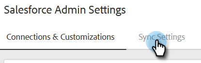

# Configurar la personalización de detalles de actividad de Salesforce {#configure-salesforce-activity-detail-customization}

>[!PREREQUISITES]
>
>* Salesforce y Marketo Sales Connect [debe estar conectado](/help/marketo/product-docs/marketo-sales-connect/crm/salesforce-integration/connect-your-sales-connect-account-to-salesforce.md)
>* Registro de la actividad de correo electrónico a través de API [debe estar habilitado](/help/marketo/product-docs/marketo-sales-connect/crm/salesforce-integration/salesforce-sync-settings.md)

La personalización de detalles de la actividad permite a los administradores configurar la información que se registrará en el campo Tarea de Salesforce - Asunto , cuando se sincronice una tarea de actividad/recordatorio de Conexión de ventas con Salesforce.

>[!NOTE]
>
>Las actualizaciones realizadas en el campo de asunto en Conexión de ventas de una tarea recordatoria se reflejarán en el campo de asunto correspondiente de la tarea de Salesforce, si está utilizando la variable `{{activity_subject}}` campo dinámico en la personalización de detalles de actividad.

<table>
 <tr>
  <td><strong>1</td>
  <td>Tarea de recordatorio de InMail</td>
 </tr>
 <tr>
  <td><strong>2</td>
  <td>Actividad de correo electrónico</td>
 </tr>
 <tr>
  <td><strong>3</td>
  <td>Actividad de llamada</td>
 </tr>
</table>

La función se puede utilizar para obtener las siguientes ventajas:

* Al personalizar la información visible en el campo del asunto, los detalles de la actividad se pueden analizar fácilmente para ventas en Salesforce.
* Los administradores pueden etiquetar el campo del asunto con un identificador único como &quot;Mkto_sales&quot;, de modo que las actividades de Sales Connect se puedan identificar y diferenciar fácilmente de otras actividades de correo electrónico, actividades de llamada y tareas.
* Reduzca la necesidad de campos de actividad personalizados. Salesforce impone límites al número de campos de actividad personalizados, lo que puede restringir qué datos están disponibles para utilizarse en los informes. Al utilizar campos dinámicos de actividad para agregar datos clave a la línea de asunto, puede reducir el número de campos de actividad personalizados que necesita crear en la instancia de Salesforce.
* El campo de asunto de actividades y tareas seguirá un patrón coherente definido por el administrador de conexión de ventas.

>[!NOTE]
>
>Si está registrando respuestas de correo electrónico como actividades en Salesforce, no utilizarán la configuración de personalización de detalles de actividad de Salesforce. En su lugar, registrarán como &quot;Responder: Asunto del correo electrónico&quot;.

## Campos dinámicos de actividad admitidos {#activity-dynamic-fields-supported}

Los campos dinámicos de actividad hacen referencia a información sobre las actividades de ventas para rellenar datos. Actualmente, se pueden utilizar con la personalización de detalles de actividad de Salesforce.

>[!NOTE]
>
>Si no hay ningún valor para rellenar el campo dinámico para una actividad/tarea específica, no rellenará ningún dato para ese campo dinámico cuando se actualice el campo Tarea - Asunto de Salesforce.

<table>
 <tr>
  <th>Campo</th>
  <th>Descripción</th>
 </tr>
 <tr>
  <td>{{activity_type}}</td>
  <td>Rellenará el tipo de tarea como Correo electrónico, Llamada, InMail o Personalizado.</td>
 </tr>
 <tr>
  <td>{{activity_subject}}</td>
  <td>
Rellenará el asunto de la tarea.

      
En el caso de un correo electrónico, se rellena la línea de asunto del correo electrónico.

      
En el caso de llamada a , inMail o personalizado, rellenará un valor si hubo una tarea de recordatorio creada con un valor en el campo nombre/asunto de la tarea.
</td>
 </tr>
 <tr>
  <td>{{sales_campaign_name}}</td>
  <td>Si la actividad se inició desde una campaña de ventas, rellenará el nombre de la campaña de ventas.</td>
 </tr>
 <tr>
  <td>{{sales_campaign_day}}</td>
  <td>Si la actividad se inició desde una campaña de ventas, rellenará el número de día de la campaña de ventas en el que se produjo esta actividad.</td>
 </tr>
 <tr>
  <td>{{sales_campaign_step}}</td>
  <td>Si la actividad se inició desde una campaña de ventas, rellenará el número de paso dentro del día de la campaña de ventas en el que se produjo esta actividad.</td>
 </tr>
 <tr>
  <td>{{call_result}}</td>
  <td>Si la actividad es una llamada y se selecciona un resultado de llamada , se rellenará el valor del resultado de la llamada.</td>
 </tr>
 <tr>
  <td>{{call_reason}}</td>
  <td>Si la actividad es una llamada y se selecciona un motivo de llamada, se rellenará el valor del motivo de la llamada.</td>
 </tr>
</table>

## Configuración de la personalización de detalles de actividad de Salesforce {#configuring-salesforce-activity-detail-customization}

>[!NOTE]
>
>**Se requieren permisos de administrador.**

Al configurar los detalles de la actividad, tenga en cuenta qué datos serían más relevantes para las ventas al revisar el historial de tareas en Salesforce.

1. Haga clic en el icono del engranaje y seleccione **Configuración**.

   

1. Haga clic en **Salesforce**.

   

1. Haga clic en **Configuración de sincronización**.

   

1. En el editor Personalización de detalles de actividad , añada cualquier texto libre que desee. El texto que añada no es dinámico y permanecerá sin cambios para el campo de asunto de todas las tareas sincronizadas con Salesforce.

   

   >[!TIP]
   >
   >Aunque no es obligatorio, ajustar el texto añadido entre corchetes rectos puede facilitar a algunas personas la discernimiento entre los datos cuando se rellenan en un campo de asunto en Salesforce. Ejemplo: `[Sales Connect] - {{Activity_type}}`

1. Agregue los campos dinámicos adicionales que desee haciendo clic en el botón **Agregar campo dinámico** botón.

   

1. Seleccione los campos dinámicos que desee.

   

1. Haga clic en **Guardar**.

   

>[!NOTE]
>
>Salesforce impone un límite de 255 caracteres. Si el detalle de la actividad supera ese límite, se truncará para garantizar que la información se almacene en el campo Asunto de Salesforce.

>[!MORELIKETHIS]
>
>* [Configuración de sincronización](/help/marketo/product-docs/marketo-sales-connect/crm/salesforce-integration/salesforce-sync-settings.md)
>* [Sincronización de tareas de recordatorio con Salesforce](/help/marketo/product-docs/marketo-sales-connect/tasks/reminder-task-sync-with-salesforce.md)
>* [Personalización de Sales Connect para CRM](/help/marketo/product-docs/marketo-sales-connect/crm/salesforce-customization/sales-connect-customizations-for-crm.md)

