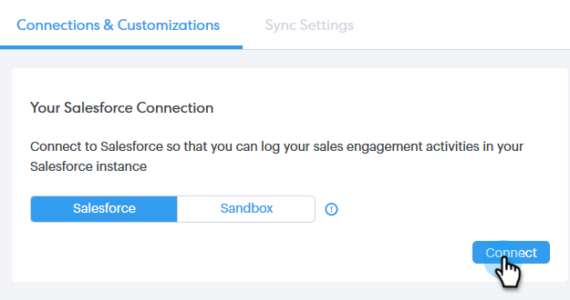

# Conectar su cuenta de Sales Connect a Salesforce {#connect-your-sales-connect-account-to-salesforce}

Siga estos sencillos pasos para conectar [!DNL Sales Connect] a [!DNL Salesforce].

## Cómo conectarse como administrador {#how-to-connect-as-an-admin}

1. En [!DNL Sales Connect], haga clic en el icono de engranaje en la esquina superior derecha y seleccione **[!UICONTROL Configuración]**.

   

1. En [!UICONTROL &#x200B; Configuración de administración], haga clic en **[!UICONTROL Salesforce]**.

   

1. En la ficha [!UICONTROL Conexiones y personalizaciones], haga clic en **[!UICONTROL Conectar]**.

   

1. Haga clic en **[!UICONTROL Aceptar]**.

   

1. Si ya ha iniciado sesión en Salesforce, estará conectado. Si no es así, se le pedirá que inicie sesión.

## Cómo conectarse sin ser administrador {#how-to-connect-as-a-non-admin}

1. En [!DNL Sales Connect], haga clic en el icono del engranaje y seleccione **[!UICONTROL Configuración]**.

   

1. En [!UICONTROL Mi cuenta], seleccione **[!UICONTROL Salesforce]**.

   

1. En la ficha [!UICONTROL Conexiones y personalizaciones], haga clic en **[!UICONTROL Conectar]**.

   

1. Haga clic en **[!UICONTROL Aceptar]**.

   

1. Si ya ha iniciado sesión en Salesforce, estará conectado. Si no es así, se le pedirá que inicie sesión.
