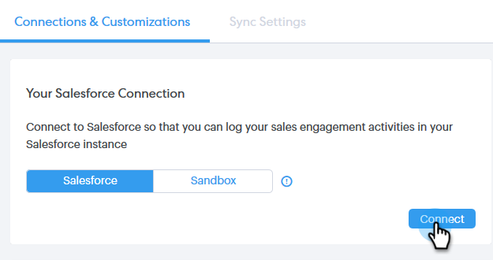

# Conectar la cuenta de Sales Connect con Salesforce {#connect-your-sales-connect-account-to-salesforce}

Siga estos sencillos pasos para conectar Sales Connect con Salesforce.

## Cómo conectarse como administrador {#how-to-connect-as-an-admin}

1. En Sales Connect, haga clic en el icono de engranaje en la esquina superior derecha y seleccione **Configuración**.

   

1. En Configuración de administración, haga clic en **Salesforce**.

   

1. En la ficha Conexiones y personalizaciones, haga clic en **Conectar**.

   

1. Haga clic en **Aceptar**.

   

1. Si ya ha iniciado sesión en Salesforce, estará conectado. Si no lo hace, se le pedirá que inicie sesión.

## Cómo conectarse como no administrador {#how-to-connect-as-a-non-admin}

1. En Sales Connect, haga clic en el icono de engranaje y seleccione **Configuración**.

   

1. En Mi cuenta, seleccione **Salesforce**.

   

1. En la ficha Conexiones y personalizaciones, haga clic en **Conectar**.

   

1. Haga clic en **Aceptar**.

   

1. Si ya ha iniciado sesión en Salesforce, estará conectado. Si no lo hace, se le pedirá que inicie sesión.
