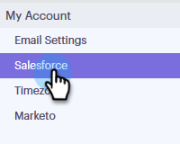

# Desconectar Salesforce De Su Cuenta De Conexión De Ventas {#disconnect-salesforce-from-your-sales-connect-account}

A veces, es posible que deba desconectar su cuenta de Salesforce de su cuenta de Sales Connect. Así es como.

## Cómo desconectarse de Salesforce como administrador {#how-to-disconnect-from-salesforce-as-an-admin}

1. En Conexión de ventas, haga clic en el icono de engranaje en la esquina superior derecha y seleccione **Configuración**.

   

1. En Configuración de administración, haga clic en **Salesforce**.

   

1. En la pestaña Conexiones y personalizaciones , haga clic en **Desconectar**.

   

## Cómo desconectarse de Salesforce como no administrador {#how-to-disconnect-from-salesforce-as-a-non-admin}

1. En Conexión de ventas, haga clic en el icono de engranaje en la esquina superior derecha y seleccione **Configuración**.

   

1. En Mi cuenta, seleccione **Salesforce**.

   

1. En la pestaña Conexiones y personalizaciones , haga clic en **Desconectar**.

   
