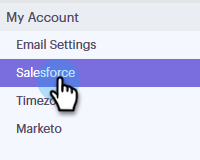

# Desconectar Salesforce de su cuenta de Sales Connect {#disconnect-salesforce-from-your-sales-connect-account}

En ocasiones, es posible que deba desconectar su cuenta de [!DNL  Salesforce] de su cuenta de [!DNL Sales Connect]. Así es cómo se hace.

## Cómo desconectarse de Salesforce como administrador {#how-to-disconnect-from-salesforce-as-an-admin}

1. En [!DNL Sales Connect], haga clic en el icono de engranaje en la esquina superior derecha y seleccione **[!UICONTROL Configuración]**.

   

1. En [!UICONTROL  Configuración de administración], haga clic en **[!UICONTROL Salesforce]**.

   

1. En la ficha [!UICONTROL Conexiones y personalizaciones], haga clic en **[!UICONTROL Desconectar]**.

   

## Cómo desconectarse de Salesforce sin ser administrador {#how-to-disconnect-from-salesforce-as-a-non-admin}

1. En [!DNL  Sales Connect], haga clic en el icono de engranaje en la esquina superior derecha y seleccione **[!UICONTROL Configuración]**.

   

1. En [!UICONTROL Mi cuenta], seleccione **[!UICONTROL Salesforce]**.

   

1. En la ficha [!UICONTROL Conexiones y personalizaciones], haga clic en **[!UICONTROL Desconectar]**.

   
