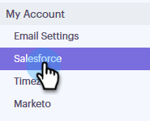

# Configuración de sincronización de Salesforce {#salesforce-sync-settings}

## Registrando Actividad por correo electrónico a Salesforce mediante API {#logging-email-activity-to-salesforce-via-api}

Esta funcionalidad requiere que esté en la edición Enterprise/Unlimited de Salesforce o en la edición Professional si ha adquirido la integración mediante la API de servicios Web.

>[!PREREQUISITES]
>
>Salesforce y el compromiso de ventas deben estar conectados.

1. En Participación de ventas, haga clic en el icono de engranaje en la esquina superior derecha y seleccione **Configuración**.

   

1. En Mi cuenta (Configuración de administración si es administrador), haga clic en **Salesforce**.

   

1. Haga clic en la ficha **Configuración de sincronización**.

   

1. Haga clic en la flecha junto a Actividad de correo electrónico de registro en Salesforce.

   

1. Haga clic en la ficha **API de Salesforce**. En esta tarjeta puede configurar su preferencia para registrar información en Salesforce. Haga clic en **Guardar** cuando termine.

   

## Registrando Actividad por correo electrónico a Salesforce mediante correo electrónico a Salesforce (BCC) {#logging-email-activity-to-salesforce-via-email-to-salesforce-bcc}

Una vez que active &quot;Correo electrónico a Salesforce (BCC)&quot;, recibirá un CCO de sus correos electrónicos de ventas y los mismos se registrarán como actividades de oportunidades, posibles clientes y contactos.

>[!PREREQUISITES]
>
>Salesforce y el compromiso de ventas deben estar conectados.

**Para registrar sus correos electrónicos en Salesforce por correo electrónico (BCC)**

1. En Participación de ventas, haga clic en el icono de engranaje en la esquina superior derecha y seleccione **Configuración**.

   

1. En Mi cuenta (Configuración de administración si es administrador), haga clic en **Salesforce**.

   

1. Haga clic en la ficha **Configuración de sincronización**.

   

1. Haga clic en la ficha **Correo electrónico para Salesforce (BCC)** y haga clic en **Activar**.

   

Si, por alguna razón, la dirección de correo electrónico a Salesforce no se extrae, siga estos pasos para activar la función CCO en la cuenta de Salesforce:

1. Inicie sesión en la instancia de Salesforce.
1. Busque su nombre de usuario en la esquina superior derecha y seleccione la barra desplegable.
1. Seleccione **Mi configuración**.
1. Seleccione **Correo electrónico**.
1. Seleccione **Mi correo electrónico a Salesforce**.
1. En esta página, verá un campo con la etiqueta &quot;Dirección de correo electrónico a Salesforce&quot;. Si no hay nada rellenado al lado, desplácese hacia abajo hasta &quot;Mis direcciones de correo electrónico aceptables&quot;.
1. Escriba las direcciones de correo electrónico que desee que sean CCO.
1. Haga clic en **Guardar cambios**.

**No puedo encontrar mi correo electrónico a Salesforce en mi configuración**

Si no ve Mi correo electrónico a Salesforce en Configuración, es posible que el administrador no lo haya habilitado. Esto puede suceder si su equipo es nuevo en Salesforce o si su equipo nunca ha utilizado la dirección de CCO que proporciona Salesforce.

>[!NOTE]
>
>Necesitará privilegios de administrador para configurarlo.

1. Haga clic en **Configuración**.
1. Haga clic en **Administración de correo electrónico**.
1. Haga clic en **Enviar correo electrónico a Salesforce**.
1. Haga clic en **Editar**.
1. Marque la casilla junto a &quot;Activo&quot;.
1. Haga clic en **Guardar**.

## Sincronizar Tareas/recordatorios de compromiso de ventas con Tareas de Salesforce {#sync-sales-engage-tasks-reminders-to-salesforce-tasks}

1. Haga clic en el icono de engranaje en la esquina superior derecha y seleccione **Configuración**.

   

1. En Mi cuenta (Configuración de administración si es administrador), haga clic en **Salesforce**.

   

1. Haga clic en la ficha **Configuración de sincronización**.

   

1. Haga clic en la flecha situada junto a Sincronizar Tareas/recordatorios de compromiso de ventas con Tareas de Salesforce.

   

1. Elija la opción que desee (&quot;No sincronizar con tareas de Salesforce&quot; está seleccionada de forma predeterminada).

   
