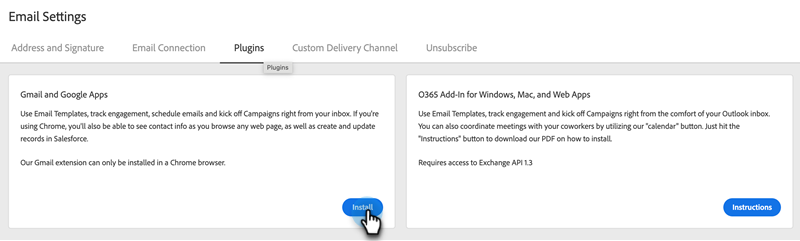

# Instalación del complemento de correo electrónico de Sales Connect para Gmail {#install-the-sales-connect-email-plugin-for-gmail}

Obtenga información sobre cómo instalar el complemento de Gmail.

>[!IMPORTANT]
>
>Los complementos de correo electrónico para Gmail y Outlook solo son compatibles con los usuarios de Marketo Sales Connect. **no** son compatibles con los usuarios de acciones de información de ventas.

1. En la [aplicación web](https://toutapp.com/next#settings), haga clic en el icono de engranaje y luego en **[!UICONTROL Configuración]**.

   

1. En Mi cuenta, haga clic en **[!UICONTROL Configuración de correo electrónico]**.

   

1. Haga clic en la ficha **[!UICONTROL Complementos]**.

   

1. En Aplicaciones de Gmail y Google, haz clic en **[!UICONTROL Instalar]**.

   
