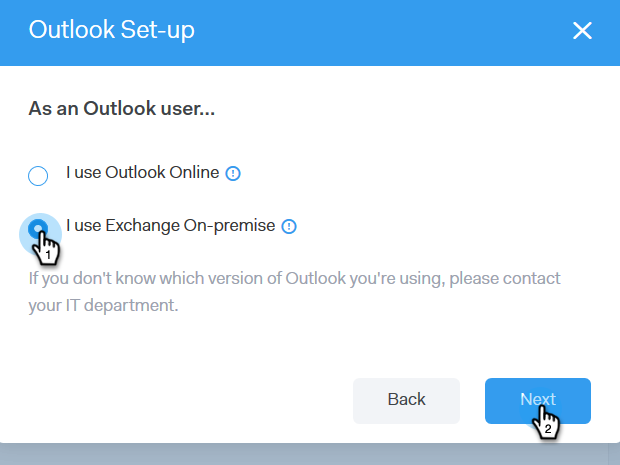

# Conexión de correo electrónico para usuarios de Outlook {#email-connection-for-outlook-users}

Aprenda a conectar su cuenta de Conexión de ventas con Outlook.

>[!NOTE]
>
>Cada usuario debe conectarse a Outlook desde su cuenta de Conexión de ventas.

## Conexión a Outlook Online {#connecting-to-outlook-online}

La conexión a Outlook significa que recibirá seguimiento de respuestas, acceso al canal de entrega de Outlook, la capacidad de programar correos electrónicos en Outlook y enviar cumplimiento.

1. En Conexión de ventas, haga clic en el icono del engranaje y seleccione **Configuración**.

   

1. En Mi cuenta, seleccione **Configuración de correo electrónico**.

   

1. Haga clic en la pestaña **Email Connection**.

   

1. Haga clic en **Introducción**.

   

1. Seleccione **utilizo Outlook para enviar correos electrónicos** y haga clic en **Siguiente**.

   

1. Seleccione la versión de Outlook que está utilizando y haga clic en **Next**. En este ejemplo elegimos Outlook Online.

   

   <table> 
    <tbody>
     <tr>
      <td><strong>Outlook en línea</strong></td> 
      <td>También conocido como Exchange Online</td> 
     </tr>
     <tr>
      <td><strong>Exchange On-Premise</strong></td> 
      <td>Incluye Exchange 2013 y 2016</td> 
     </tr>
    </tbody>
   </table>

   >[!NOTE]
   >
   >Marketo no admite cuentas híbridas de Exchange en este momento.

1. Haga clic en **OK**.

   

1. Si no ha iniciado sesión en Outlook, introduzca la información de inicio de sesión y haga clic en **Next**. Si lo está, elija la cuenta a la que desea conectarse y haga clic en **Siguiente**. En este ejemplo, ya hemos iniciado sesión.

   

1. Haga clic en **Accept**.

   

   Puede utilizar esta conexión para rastrear correos electrónicos y también como canal de envío.

   >[!NOTE]
   >
   >Outlook Online (Office365) aplica sus propios límites de envío. [Obtenga más información aquí](/help/marketo/product-docs/marketo-sales-connect/email/email-delivery/email-connection-throttling.md#email-provider-limits).

## Conexión a Exchange On-Premise {#connecting-to-exchange-on-premise}

La conexión a Exchange On-Premise significa que recibirá seguimiento de respuestas, acceso al canal de entrega de Outlook, la capacidad de programar correos electrónicos en Outlook y enviar cumplimiento de normas.

1. En Conexión de ventas, haga clic en el icono del engranaje y seleccione **Configuración**.

   

1. En Mi cuenta, seleccione **Configuración de correo electrónico**.

   

1. Haga clic en la pestaña **Email Connection**.

   

1. Haga clic en **Introducción**.

   

1. Seleccione **utilizo Outlook para enviar correos electrónicos** y haga clic en **Siguiente**.

   

1. Seleccione la versión de Outlook que está utilizando y haga clic en **Next**. En este ejemplo elegimos Exchange On-Premise.

   

   <table> 
    <tbody>
     <tr>
      <td><strong>Outlook en línea</strong></td> 
      <td>También conocido como Exchange Online</td> 
     </tr>
     <tr>
      <td><strong>Exchange On-Premise</strong></td> 
      <td>Incluye Exchange 2013 y 2016</td> 
     </tr>
    </tbody>
   </table>

1. Introduzca sus credenciales y haga clic en **Connect**.

   

   >[!NOTE]
   >
   >Si desactiva Autodiscover en la lista desplegable Versión de Exchange , deberá solicitar al departamento de TI la URL de Exchange.

   Puede utilizar esta conexión para rastrear correos electrónicos y también como canal de envío.

   >[!NOTE]
   >
   >Al utilizar Exchange On-Premim, su equipo de TI establecerá su límite de envío de correo electrónico.
