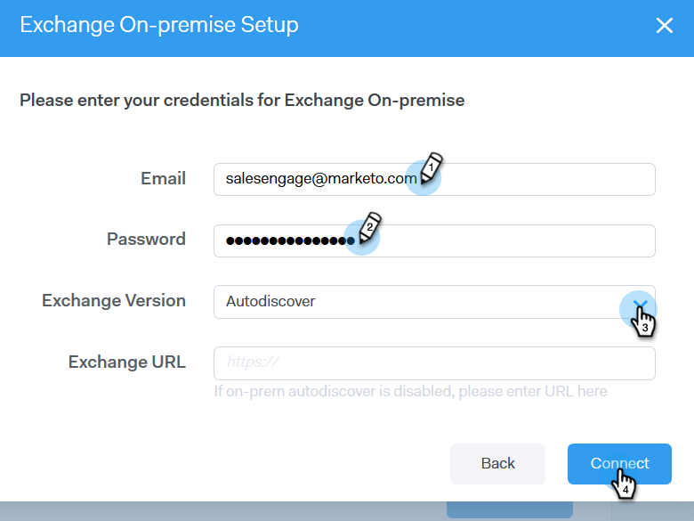

# Conexión de correo electrónico para usuarios de [!DNL Outlook] {#email-connection-for-outlook-users}

Aprenda a conectar su cuenta de [!DNL Sales Connect] con [!DNL Outlook].

>[!NOTE]
>
>Cada usuario debe conectarse a [!DNL Outlook] desde su cuenta de [!DNL Sales Connect].

## Conectando con [!DNL Outlook] en línea {#connecting-to-outlook-online}

Conectarse a [!DNL Outlook] significa que recibirá seguimiento de respuestas, acceso al canal de entrega [!DNL Outlook], la capacidad de programar correos electrónicos en [!DNL Outlook] y enviar conformidad.

1. En [!DNL Sales Connect], haga clic en el icono del engranaje y seleccione **[!UICONTROL Configuración]**.

   

1. En Mi cuenta, seleccione **[!UICONTROL Configuración de correo electrónico]**.

   

1. Haga clic en la ficha **[!UICONTROL Conexión de correo electrónico]**.

   

1. Haga clic en **[!UICONTROL Comenzar]**.

   

1. Seleccione **[!UICONTROL Utilizo Outlook para enviar mensajes de correo electrónico]** y haga clic en **[!UICONTROL Siguiente]**.

   

1. Seleccione la versión de [!DNL Outlook] que está usando y haga clic en **[!UICONTROL Siguiente]**. En este ejemplo elegimos [!DNL Outlook Online].

   

   <table> 
    <tbody>
     <tr>
      <td><strong>[!DNL Outlook Online]</strong></td> 
      <td>También conocido como [!DNL Exchange Online]</td> 
     </tr>
     <tr>
      <td><strong>[!DNL Exchange On-premise]</strong></td> 
      <td>Incluye [!DNL Exchange] 2013 y 2016</td> 
     </tr>
    </tbody>
   </table>

   >[!NOTE]
   >
   >Marketo no admite cuentas de [!DNL Exchange Hybrid] en este momento.

1. Haga clic en **[!UICONTROL Aceptar]**.

   

1. Si no inició sesión en [!DNL Outlook], ingrese su información de inicio de sesión y haga clic en **[!UICONTROL Siguiente]**. Si es así, elija la cuenta a la que desea conectarse y haga clic en **[!UICONTROL Siguiente]**. En este ejemplo, ya hemos iniciado sesión.

   

1. Haga clic en **[!UICONTROL Aceptar]**.

   

   Puede utilizar esta conexión para rastrear correos electrónicos y también como canal de envío.

   >[!NOTE]
   >
   >[!DNL Outlook Online (Office365)] impone sus propios límites de envío. [Obtenga más información aquí](/help/marketo/product-docs/marketo-sales-connect/email/email-delivery/email-connection-throttling.md#email-provider-limits).

## Conectando con [!DNL Exchange On-Premise] {#connecting-to-exchange-on-premise}

Conectarse a [!DNL Exchange On-Premise] significa que recibirá seguimiento de respuestas, acceso al canal de entrega [!DNL Outlook], la capacidad de programar correos electrónicos en [!DNL Outlook] y enviar conformidad.

1. En [!DNL Sales Connect], haga clic en el icono del engranaje y seleccione **[!UICONTROL Configuración]**.

   

1. En [!UICONTROL Mi cuenta], seleccione **[!UICONTROL Configuración de correo electrónico]**.

   

1. Haga clic en la ficha **[!UICONTROL Conexión de correo electrónico]**.

   

1. Haga clic en **[!UICONTROL Comenzar]**.

   

1. Seleccione **[!UICONTROL Utilizo Outlook para enviar mensajes de correo electrónico]** y haga clic en **[!UICONTROL Siguiente]**.

   

1. Seleccione la versión de [!DNL Outlook] que está usando y haga clic en **[!UICONTROL Siguiente]**. En este ejemplo elegimos [!DNL Exchange On-premise].

   

   <table> 
    <tbody>
     <tr>
      <td><strong>[!DNL Outlook Online]</strong></td> 
      <td>También conocido como [!DNL Exchange Online]</td> 
     </tr>
     <tr>
      <td><strong>[!DNL Exchange On-premise]</strong></td> 
      <td>Incluye [!DNL Exchange] 2013 y 2016</td> 
     </tr>
    </tbody>
   </table>

1. Escriba sus credenciales y haga clic en **[!UICONTROL Conectar]**.

   

   >[!NOTE]
   >
   >Si desactiva Detección automática en la lista desplegable Versión de [!DNL Exchange], tendrá que pedirle a su departamento de TI la URL [!DNL Exchange].

   Puede utilizar esta conexión para rastrear correos electrónicos y también como canal de envío.

   >[!NOTE]
   >
   >Al usar [!DNL Exchange On-prem], su equipo de TI establecerá el límite de envíos de correo electrónico.
