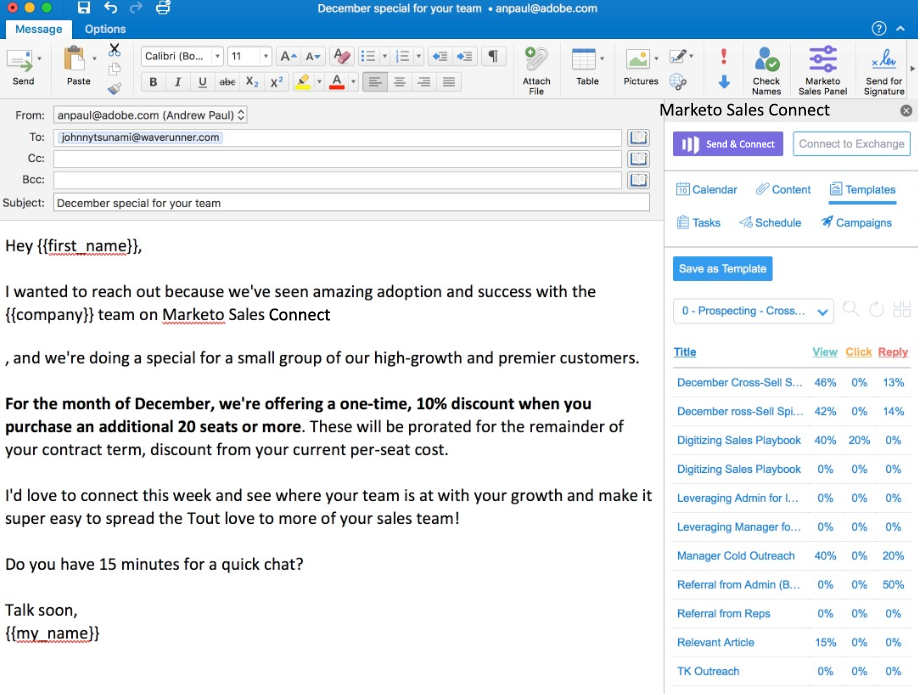

# Instalación del complemento de correo electrónico de Sales Connect para Outlook (en línea, Mac y Windows) {#install-the-sales-connect-email-plugin-for-outlook}

Hemos creado una integración con [!DNL Outlook Web Apps]. [!DNL Outlook Web Apps] es una versión de [!DNL Outlook] proporcionada con la suscripción de [!DNL Office 365]. Como se basa en el explorador, la integración funcionará tanto en Mac como en [!DNL Windows]. [Haga clic aquí para obtener la guía de instalación completa](https://s3.amazonaws.com/tout-user-store/outlook-mac/assets/install_tout_add-in_outlook_mac.pdf).

Como administrador, puedes [instalar esto en nombre de todo tu equipo](https://docs.microsoft.com/en-us/office365/admin/manage/manage-deployment-of-add-ins?view=o365-worldwide).

>[!IMPORTANT]
>
>Los complementos de correo electrónico para Gmail y Outlook solo son compatibles con los usuarios de Marketo Sales Connect. **no** son compatibles con las acciones de Insight de ventas.

>[!NOTE]
>
>Si no tiene un botón de tienda, no se encuentra en la última versión de [!DNL Outlook] para Mac. Siga estos pasos para ponerse al día:
>
>i. Vaya al botón Ayuda (en la barra de navegación superior, a la derecha de &quot;Outlook&quot;)
>
>ii. Elija **[!UICONTROL Buscar actualizaciones]** en el menú desplegable
>
>iii. Actualice a la versión más reciente de Outlook y vuelva a estos pasos cuando haya terminado

>[!NOTE]
>
>El complemento .Net ya no admite la programación de correos electrónicos de [!DNL Outlook]. Tendrá que actualizar al complemento [!DNL Office365] para programar correos electrónicos.
