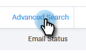
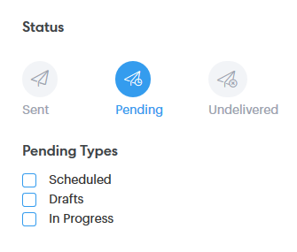
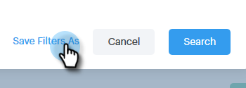

# Información general de búsqueda avanzada {#advanced-search-overview}

Al utilizar la búsqueda avanzada para clientes potenciales de destinatario que han visto, hecho clic o respondido a correos electrónicos, puede crear una lista de objetivo de los clientes potenciales más comprometidos.

## Cómo acceder a la búsqueda avanzada {#how-to-access-advanced-search}

1. Haga clic en **Centro de comandos**.

   

1. Haga clic en **Mensajes de correo electrónico**.

   

1. Elija la ficha correspondiente.

   

1. Haga clic en **Búsqueda avanzada**.

   

## Filtros {#filters}

**Fecha**

Elija el intervalo de fechas para la búsqueda. Las fechas preestablecidas se actualizan según el estado del correo electrónico que elija (Enviado, No entregado, Pendiente).

**Quién**

Filtre por destinatario/remitente de correo electrónico en la sección Quién.

| Desplegable | Descripción |
|---|---|
| **Vista como** | Filtre por un remitente específico en la instancia de Sales Connect (esta opción solo está disponible para los administradores). |
| **Por grupo** | Filtre los correos electrónicos según un grupo específico de destinatarios. |
| **Por persona** | Filtrar por un destinatario específico. |

**When**

Elija por fecha de creación, fecha de entrega, fecha de error o fecha programada. Las opciones disponibles cambian según el estado del correo electrónico que elija (Enviado, No entregado, Pendiente).

**Campañas**

Filtre los correos electrónicos por participación de campaña.

**Estado**

Existen tres estados de correo electrónico para elegir. Las opciones de tipo/actividad cambian según el estado seleccionado.

***Estado: Enviado***

Filtros por su actividad de correo electrónico enviada. Puede elegir vistas/sin vistas, clics/sin clics y/o respuestas/sin respuestas.

***Estado: Pendiente***

Filtros por todos los correos electrónicos pendientes.

| Estado | Descripción |
|---|---|
| **Programado** | Correos electrónicos programados desde la ventana de composición (Salesforce o la aplicación web), complementos de correo electrónico o una campaña. |
| **Borradores** | Correos electrónicos que están actualmente en estado borrador. Los mensajes de correo electrónico requieren una línea de asunto y un destinatario para guardarse como borrador. |
| **En curso** | Correos electrónicos que se están enviando. Los correos electrónicos no deben permanecer en este estado durante más de unos segundos. |

***Estado: No entregado***

Filtros por correo electrónico que nunca se entregaron.

| Estado | Descripción |
|---|---|
| **Error** | Cuando un correo electrónico no se puede enviar desde Sales Connect (los motivos comunes incluyen: mensajes de correo electrónico que se envían a los contactos cancelados o bloqueados, o si se ha producido un problema al rellenar los campos dinámicos). |
| **Devuelto** | Un correo electrónico se marca como devuelto cuando el servidor del destinatario lo rechaza. Aquí solo se mostrarán los correos electrónicos enviados a través de los servidores de Sales Connect. |
| **Correo no deseado** | Cuando el destinatario marcó el correo electrónico como correo no deseado (término común para correo electrónico no solicitado). Aquí solo se mostrarán los correos electrónicos enviados a través de los servidores de Sales Connect. |

## Búsquedas guardadas {#saved-searches}

A continuación se muestra cómo crear una búsqueda guardada.

1. Una vez que todos los filtros estén colocados, haga clic en **Guardar Filtros como**.

   

1. Asigne un nombre a la búsqueda y haga clic en **Guardar**.

   

   Las búsquedas guardadas estarán en la barra lateral de la izquierda.

   
