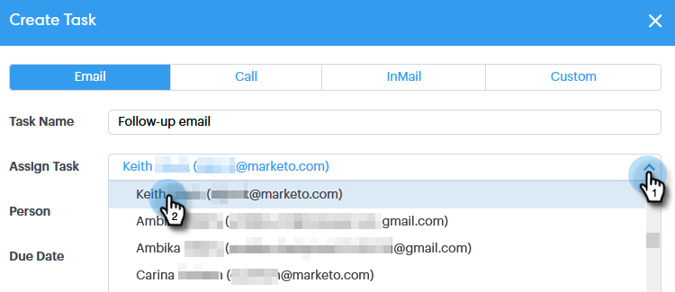

# Asignación de tareas a integrantes del equipo {#assigning-tasks-to-team-members}

Si desea colaborar con otros integrantes del equipo, la asignación de tareas puede ser una buena manera de coordinar los esfuerzos de prospección.

>[!NOTE]
>
>Solo puede asignar tareas para contactos compartidos.

1. Haga clic en el **Centro de comandos**.

   

1. Haga clic en **Agregar tarea**.

   

1. Seleccione el tipo de tarea.

   

1. Asigne un nombre a la tarea.

   

1. Seleccione la persona del equipo a la que desea asignar la tarea en el campo Asignar tarea .

   

1. Agregue a la persona a la que desee ponerse en contacto en el campo de persona.

   

1. Seleccione la Fecha de vencimiento.

   

1. Establezca la Prioridad.

   

1. Añada cualquier detalle importante que sea relevante para su compañero de equipo (opcional) y haga clic en **Crear**.

   
