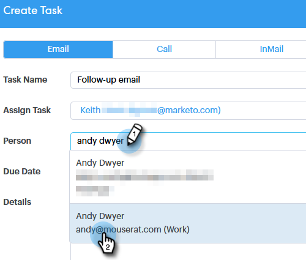

# Asignar tareas a integrantes del equipo {#assigning-tasks-to-team-members}

Si desea colaborar con otros integrantes del equipo, asignar tareas puede ser una buena manera de coordinar sus esfuerzos de prospección.

>[!NOTE]
>
>Solo puede asignar tareas para contactos compartidos.

1. Haga clic en **Centro de comandos**.

   

1. Clic **Agregar tarea**.

   

1. Seleccione el tipo de tarea.

   

1. Asigne un nombre a la tarea.

   

1. Seleccione a la persona de su equipo a la que desee asignar la tarea en el campo Asignar tarea.

   

1. Añada la persona a la que desee ponerse en contacto en el campo persona.

   

1. Seleccione la Fecha de vencimiento.

   

1. Establezca la Prioridad.

   

1. Añada cualquier detalle importante que sea relevante para su compañero (opcional) y haga clic en **Crear**.

   
