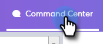
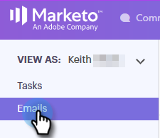
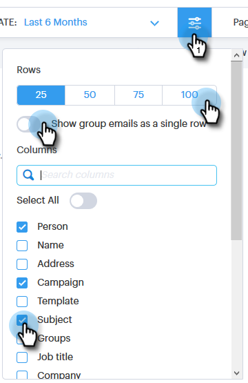

# Columnas de correo electrónico y diseño de página del correo electrónico {#email-columns-and-email-page-layout}

Puede configurar cualquiera de las columnas disponibles para que sean visibles en la sección de correo electrónico del [!UICONTROL Centro de comandos]. La configuración se guardará para cada subcarpeta de correo electrónico (por ejemplo, [!UICONTROL Entregado], [!UICONTROL Fallido], [!UICONTROL Programado], etc.).

## Columnas de correo electrónico {#email-columns}

<table>
 <colgroup>
  <col>
  <col>
 </colgroup>
 <tbody>
  <tr>
   <th>
Columna
</th>
   <th>Descripción</th>
  </tr>
  <tr>
   <td>[!UICONTROL Persona]</td>
   <td>Nombre y correo electrónico de la persona en [!DNL Sales Connect]. Al hacer clic en este campo, se abrirá la pestaña Acerca de en la vista de detalles de la persona.</td>
  </tr>
  <tr>
   <td>[!UICONTROL Nombre]</td>
   <td>Nombre de la persona en [!DNL Sales Connect].</td>
  </tr>
  <tr>
   <td>[!UICONTROL Dirección]</td>
   <td>Dirección de correo electrónico principal de la persona en [!DNL Sales Connect].</td>
  </tr>
  <tr>
   <td>[!UICONTROL Campaign]</td>
   <td>Si el correo electrónico se envió como parte de una campaña, se mostrará el nombre de la campaña. Al hacer clic en este campo, accederá a la página de configuración de la campaña.</td>
  </tr>
  <tr>
   <td>[!UICONTROL Template]</td>
   <td>Muestra el nombre de la plantilla (si el correo electrónico se envió con una).</td>
  </tr>
  <tr>
   <td colspan="1">[!UICONTROL Asunto]</td>
   <td colspan="1">Línea de asunto del correo electrónico.</td>
  </tr>
  <tr>
   <td colspan="1">[!UICONTROL Grupos]</td>
   <td colspan="1">Muestra los grupos a los que pertenece el destinatario del correo electrónico.</td>
  </tr>
  <tr>
   <td>[!UICONTROL Puesto]</td>
   <td>Título del destinatario del correo electrónico.</td>
  </tr>
  <tr>
   <td>[!UICONTROL Company]</td>
   <td>Compañía del destinatario del correo electrónico.</td>
  </tr>
  <tr>
   <td>[!UICONTROL Estado de correo electrónico]</td>
   <td>Estado en el que se encuentra el correo electrónico. Los estados incluyen: Borrador, Programado, En curso, Correo no deseado, Devuelto, Fallido, Enviado. Los correos electrónicos enviados mostrarán un flujo de actividad que indica cuántas vistas, clics y respuestas se han realizado en ese correo electrónico.</td>
  </tr>
  <tr>
   <td>[!UICONTROL Fecha de creación]</td>
   <td>Fecha de creación del correo electrónico.</td>
  </tr>
  <tr>
   <td>[!UICONTROL Última actualización]</td>
   <td>Fecha de la última actualización del correo electrónico.</td>
  </tr>
  <tr>
   <td>[!UICONTROL Canal de entrega]</td>
   <td>Nombre del canal de envío que se utilizó para enviar el correo electrónico.</td>
  </tr>
  <tr>
   <td>[!UICONTROL Última actividad]</td>
   <td>La última participación del destinatario del correo electrónico (por ejemplo, ver, hacer clic o responder).</td>
  </tr>
  <tr>
   <td>[!UICONTROL Fecha de envío]</td>
   <td>La fecha en la que se envió el correo electrónico.</td>
  </tr>
  <tr>
   <td>Acciones de [!UICONTROL Follow Up]</td>
   <td>Botones de acción rápida que se pueden utilizar para el seguimiento por correo electrónico, teléfono, inMail o tarea.</td>
  </tr>
  <tr>
   <td>[!UICONTROL Group Email]</td>
   <td>Muestra una marca de verificación si el correo electrónico se envió como parte de un mensaje de correo electrónico de grupo.</td>
  </tr>
  <tr>
   <td>[!UICONTROL Fecha de vencimiento de tarea]</td>
   <td>Muestra la fecha de vencimiento de las tareas relacionadas con el correo electrónico. Las tareas pueden relacionarse con un correo electrónico mediante la creación de botones de acción rápida en la lista de correo electrónico.</td>
  </tr>
  <tr>
   <td>[!UICONTROL Email Action]</td>
   <td>Botones de acción rápida que se pueden utilizar para realizar acciones en el correo electrónico. Según el estado del correo electrónico, pueden estar disponibles las siguientes acciones: Archivar, Correcto, Eliminar, Reintentar, Enviar y Desarchivar.</td>
  </tr>
  <tr>
   <td>[!UICONTROL Tipo de tarea]</td>
   <td>Muestra el tipo de tarea de una tarea relacionada con el correo electrónico. Las tareas pueden relacionarse con un correo electrónico mediante la creación de botones de acción rápida en la lista de correo electrónico.</td>
  </tr>
  <tr>
   <td>[!UICONTROL Fecha de error]</td>
   <td>Muestra la fecha en la que se produjo un error en el correo electrónico si este no se entregó.</td>
  </tr>
 </tbody>
</table>

## Configuración de diseño de página de correo electrónico {#email-page-layout-settings}

Puede configurar el diseño siguiendo estos pasos.

1. Vaya al **[!UICONTROL Centro de comandos]**.

   

1. Seleccione la sección **[!UICONTROL Correos electrónicos]**.

   

1. Haga clic en el botón de configuración. Las opciones incluyen: elegir cuántas filas desea, seleccionar qué campos desea que aparezcan y seleccionar si desea agrupar los correos electrónicos en un solo elemento de la cuadrícula (o si desea que todos los correos electrónicos que forman parte de una cuadrícula de correo electrónico se muestren como un solo elemento).

   

1. Simplemente haga clic fuera de la configuración cuando haya terminado.
