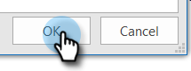

# Prevención de autovistas {#preventing-self-views}

## Resumen {#overview}

Obtener falsos positivos en el seguimiento de vista puede provocar incoherencias en los informes. Esto suele ocurrir cuando los usuarios de MSC invocan accidentalmente el píxel de seguimiento de su cliente de correo electrónico (lo llamamos vista automática). A continuación se ofrecen algunos consejos para reducir e incluso eliminar las opiniones personales de forma significativa.

## Web (Outlook Web App y Gmail) {#web-outlook-web-app-and-gmail}

Sales Connect almacenará una cookie en el explorador para evitar que se rastreen las vistas al abrir los correos electrónicos de Outlook Web App y Gmail. Si sigue recibiendo autovistas, le recomendamos que haga lo siguiente:

* Asegúrese de tener habilitadas las cookies en su equipo.

* Si utiliza un equipo o dispositivo móvil nuevo, asegúrese de haber iniciado sesión en la aplicación web. Esto nos permitirá reconocer el equipo/dispositivo a partir de ahora.

## Escritorio (Windows) {#desktop-windows}

Las vistas se rastrean descargando un pequeño píxel de imagen invisible en su cliente de correo electrónico. Puede reducir significativamente la cantidad de autovistas en Outlook desactivando las imágenes para que se descarguen automáticamente. A continuación se muestran los pasos de cómo.

1. En Outlook, haga clic en **Archivo** en la barra de menús.

   

1. Haga clic en **Opciones**.

   

1. En el cuadro de diálogo Opciones de Outlook, haga clic en **Centro de confianza**.

   

1. En el Centro de confianza de Microsoft Outlook, haga clic en **Configuración del centro de confianza**.

   

1. Haga clic en Descarga automática en el menú de la izquierda y seleccione la opción **No descargue imágenes automáticamente en el correo electrónico del HTML o en los elementos RSS** en el Navegador.

   

1. Haga clic en **OK** en el cuadro de diálogo Centro de confianza.

   

1. Haga clic en **OK** en el cuadro de diálogo Opciones de Outlook.

   

## Escritorio (Mac) {#desktop-mac}

Las vistas se rastrean descargando un pequeño píxel de imagen invisible en su cliente de correo electrónico. Puede reducir significativamente la cantidad de autovistas en Outlook desactivando las imágenes para que se descarguen automáticamente. A continuación se muestran los pasos de cómo.

1. En Outlook, haga clic en **Outlook** en la barra de menús y seleccione **Preferencias**.

   

1. En Correo electrónico, elija **Lectura**.

   

1. En Seguridad, haga clic en la **Nunca** botón de opción.

   
