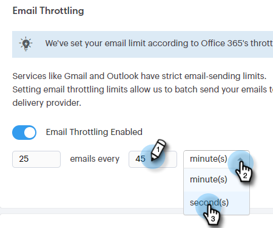

# Restricción de conexión de correo electrónico {#email-connection-throttling}

Al integrar su cuenta de Sales Connect para enviarla a través de los proveedores de correo electrónico de Exchange o Gmail, se ofrece una configuración optimizada y se optimiza la capacidad de entrega de correo electrónico para la comunicación de ventas 1:1. Sin embargo, para mantener los sistemas en buen estado y las cuentas seguras, Gmail y Exchange aplican límites de envío de correo electrónico. Estos límites están abiertos a ser aumentados o disminuidos a discreción de los proveedores.

## Información general {#overview}

La restricción de conexión de correo electrónico permite a los administradores de Sales Connect configurar la velocidad de envío de los mensajes de correo electrónico al utilizar Gmail o Exchange como canal de envío, de modo que la velocidad a la que se entregan los mensajes de correo electrónico al proveedor del canal de envío no supere los límites impuestos.

Cuando se exceden los límites de forma constante, esto a veces se puede ver como un comportamiento sospechoso por parte del proveedor del canal de entrega, lo que provoca que los correos electrónicos fallen y a veces incluso que se deshabilite una cuenta.

**Notas/Aspectos destacados**

* Se activa automáticamente una vez que un usuario se conecta a Gmail o Exchange
* Se puede personalizar si desea aumentar o reducir la configuración de Recommendations para satisfacer sus necesidades
* Solo restringe los correos electrónicos enviados a través de Gmail o Exchange, no restringe el canal de envío personalizado
* La restricción de conexión de correo electrónico pone en cola los correos electrónicos de cada usuario individual por separado, ya que cada usuario tiene su propia conexión con su proveedor de correo electrónico

**Configuración de la limitación de conexión de correo electrónico**

1. Haga clic en el icono del engranaje y seleccione **Configuración**.

   

1. Clic **General**.

   

1. En la tarjeta Restricción de conexión de correo electrónico, introduzca el tamaño de lote deseado de los correos electrónicos que se enviarán al proveedor del canal de correo electrónico.

   

1. Establezca la cantidad de tiempo de espera antes de que se envíe cada lote. En este ejemplo, elegimos 25 correos electrónicos cada 45 segundos.

   

1. Clic **Guardar**.

   

Con los cambios guardados, todos los usuarios recibirán sus correos electrónicos en lotes en su cuenta conectada de Gmail o Exchange para que los envíen.

## Límites del proveedor de correo electrónico {#email-provider-limits}

**Outlook 365**

Empresa/Empresa

* 10.000 al día
* 30 por minuto
* 500 destinatarios por correo electrónico

Más información [se puede encontrar aquí](https://docs.microsoft.com/en-us/office365/servicedescriptions/exchange-online-service-description/exchange-online-limits?redirectedfrom=MSDN#RecipientLimits).

**Gmail**

* 2.000 al día (500 para cuentas de prueba y marcadas)
* 2 correos electrónicos por segundo (límite de API)
* 2000 destinatarios por mensaje (máximo de 500 para destinatarios externos)

Más información [se puede encontrar aquí](https://support.google.com/a/answer/166852?hl=en).

**Microsoft Exchange Server (2010, 2013)**

El departamento de TI de la organización establece los límites a medida que la organización aloja el servidor. Póngase en contacto con el administrador de red o del sistema según corresponda para obtener más información.

>[!MORELIKETHIS]
>
>* [Resumen del canal de entrega](/help/marketo/product-docs/marketo-sales-connect/email/email-delivery/delivery-channel-overview.md)
>* [Conexión de correo electrónico para usuarios de Gmail](/help/marketo/product-docs/marketo-sales-connect/email-plugins/gmail/email-connection-for-gmail-users.md)
>* [Conexión de correo electrónico para usuarios de Outlook](/help/marketo/product-docs/marketo-sales-connect/email-plugins/msc-for-outlook/email-connection-for-outlook-users.md)
