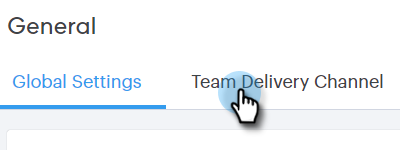

# Configuración de un canal de entrega personalizado {#setting-up-a-custom-delivery-channel}

[!DNL Marketo Sales Connect] le permite integrar con un servidor SMTP personalizado para el envío de sus correos electrónicos. Esta es una excelente opción para aquellos que no desean enviar correos electrónicos masivos fuera de su canal de entrega de Gmail o [!DNL Exchange].

Los usuarios pueden configurar un servidor SMTP personalizado para su propio uso individual, o los administradores pueden configurar un SMTP de equipo para compartirlo entre todos los usuarios de [!DNL Sales Connect] de su instancia.

>[!NOTE]
>
>* Además de configurar su servidor SMTP, su [identidad de correo electrónico debe verificarse](/help/marketo/product-docs/marketo-sales-connect/getting-started/email-settings/verify-your-email.md) para poder enviar correos electrónicos.
>* Se recomienda trabajar con su equipo de TI o con el proveedor de servidores SMTP para obtener las credenciales de servidor adecuadas para su servidor SMTP.
>* No puede conectar su servidor Gmail y [!DNL Exchange] con las credenciales del servidor SMTP. Utilice nuestro servicio de conexión de correo electrónico para integrarse con estos proveedores.

## SMTP personalizado {#custom-smtp}

1. Inicie sesión en la [aplicación web](https://toutapp.com/login), haga clic en el icono de engranaje en la parte superior derecha y elija **[!UICONTROL Configuración]**.

   

1. En [!UICONTROL Mi cuenta], haga clic en **[!UICONTROL Configuración de correo electrónico]**.

   

1. Haga clic en **[!UICONTROL Canal de entrega personalizado]**.

   

1. Escriba sus credenciales de [!UICONTROL SMTP Server] y haga clic en **[!UICONTROL Conectar]**.

   

   >[!NOTE]
   >
   >Si este es su único canal de envío, se asigna automáticamente a todas las identidades de correo electrónico y ha terminado aquí. Si este no es el único canal de envío, siga con el paso 5.

1. Mientras sigue en [!UICONTROL Configuración de correo electrónico], haga clic en **[!UICONTROL Dirección y firma]**.

   

1. Busque la identidad de correo electrónico para la que desea elegir un canal de entrega y haga clic en **[!UICONTROL Elegir canal de entrega]**.

   

1. En la tarjeta [!UICONTROL Deliverability], haga clic en **[!UICONTROL Editar]**.

   

1. Haga clic en el menú desplegable [!UICONTROL Canal] y elija el canal de entrega personalizado que acaba de agregar. Haga clic en **[!UICONTROL Guardar]**.

   

   >[!NOTE]
   >
   >Si el administrador del equipo configura el servidor SMTP de equipo, se aplicará automáticamente solo a su identidad de correo electrónico predeterminada y estará disponible como opción para el resto de identidades de correo electrónico.

## Servidor SMTP del equipo {#team-smtp-server}

>[!NOTE]
>
>**Se requieren permisos de administración**

1. Inicie sesión en la [aplicación web](https://toutapp.com/login), haga clic en el icono de engranaje en la parte superior derecha y elija **[!UICONTROL Configuración]**.

   

1. En [!UICONTROL Configuración de administración], haga clic en **[!UICONTROL General]**.

   

1. Haga clic en **[!UICONTROL Canal de envío de equipo]**.

   

1. Escriba sus credenciales de [!UICONTROL SMTP Server] y haga clic en **[!UICONTROL Conectar]**.

   

   >[!NOTE]
   >
   >El servidor SMTP de equipo será el canal de entrega predeterminado de la identidad de correo electrónico predeterminada para todos los integrantes del equipo. Además, estará disponible como opción de canal de envío para todas las demás identidades de correo electrónico.

   >[!MORELIKETHIS]
   >
   >* [Conexión de correo electrónico para usuarios de Gmail](/help/marketo/product-docs/marketo-sales-connect/email-plugins/gmail/email-connection-for-gmail-users.md)
   >
   >* [Conexión de correo electrónico para [!DNL Outlook] Usuarios](/help/marketo/product-docs/marketo-sales-connect/email-plugins/msc-for-outlook/email-connection-for-outlook-users.md)
