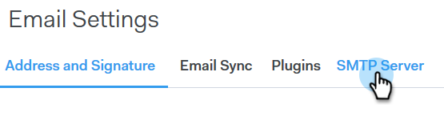
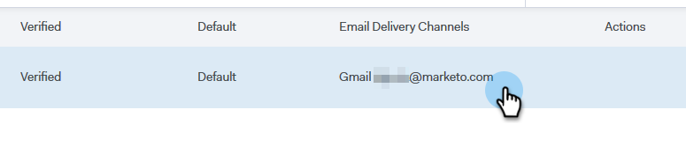

# Configuración del Canal de Envío {#setting-up-your-delivery-channel}

Al realizar el inicio con MarketingTo Sales Connect, deberá configurar un servidor SMTP para enviar correos electrónicos.

>[!NOTE]
>
>Además de configurar el servidor SMTP, su identidad de [correo electrónico debe verificarse](/help/marketo/product-docs/marketo-sales-connect/getting-started/email-settings/verify-your-email.md) para poder enviar correos electrónicos.

Puede elegir entre enviar correos electrónicos mediante un servidor SMTP personalizado, un servidor SMTP de equipo o Gmail como canal de envío. Pasemos cada opción.

## SMTP personalizado {#custom-smtp}

1. Inicie sesión en la [aplicación Web](https://toutapp.com/login), haga clic en el icono de engranaje en la parte superior derecha y elija **Configuración**.

   

1. En Mi cuenta, haga clic en **Configuración de correo electrónico**.

   

1. Seleccione **Servidor SMTP**.

   

1. Introduzca las credenciales del servidor SMTP y haga clic en **Conectar**.

   

   >[!NOTE]
   >
   >Si este es su único canal de envío, se asigna automáticamente a todas sus identidades de correo electrónico, y ya ha terminado aquí. Si este no es su único canal de envío, continúe con el paso 5.

1. Mientras sigue en Configuración de correo electrónico, haga clic en **Dirección y firma**.

   

1. Busque la identidad de correo electrónico para la que desea elegir un canal de envío y haga clic en **Elegir Canal de Envío**.

   

1. En la tarjeta de entregabilidad, haga clic en **Editar**.

   

1. Haga clic en la lista desplegable Canal y elija el canal de envío personalizado que acaba de agregar. Haga clic en **Guardar**.

   

   >[!NOTE]
   >
   >Si el administrador del equipo configura el servidor SMTP del equipo, se aplicará automáticamente solo a su identidad de correo electrónico predeterminada y estará disponible como opción para las demás identidades de correo electrónico.

## Servidor SMTP de equipo {#team-smtp-server}

>[!NOTE]
>
>**Se requieren permisos de administración**

1. Inicie sesión en la [aplicación Web](https://toutapp.com/login), haga clic en el icono de engranaje en la parte superior derecha y elija **Configuración**.

   

1. En Configuración de administración, haga clic en **Team SMTP Server**.

   

1. Introduzca las credenciales del servidor SMTP y haga clic en **Conectar**.

   

   >[!NOTE]
   >
   >El servidor SMTP de equipo será el canal de envío predeterminado de la identidad de correo electrónico predeterminada para todos los miembros del equipo. Además, estará disponible como opción de canal de envío para todas las demás identidades de correo electrónico.

## Gmail {#gmail}

1. Inicie sesión en la [aplicación Web](https://toutapp.com/login), haga clic en el icono de engranaje en la parte superior derecha y elija **Configuración**.

   

1. En Mi cuenta, haga clic en **Configuración de correo electrónico**.

   

1. Haga clic en **Sincronización de correo electrónico**.

   

1. Haga clic en **Conectar a Google**.

   

1. Inicie sesión con sus credenciales de Google.

1. Cuando llegue a esta pantalla, haga clic en **Permitir**.

   

   >[!NOTE]
   >
   >Si este es su único canal de envío, se asigna automáticamente a todas sus identidades de correo electrónico, y ya ha terminado aquí. Si Gmail no es su único canal de envío, continúe con el paso 7.

1. Haga clic en **Dirección y firma**.

   

1. Haga clic en la identidad de correo electrónico para la que desea que Gmail sea el canal de envío.

   

1. Cuando se abra el panel deslizante, desplácese hacia abajo hasta la tarjeta de entrega.

   

1. Haga clic en la lista desplegable Canal y elija el canal de envío de Gmail que acaba de agregar. Haga clic en **Guardar**.

   

   >[!NOTE]
   >
   >Si el administrador del equipo configura el servidor SMTP del equipo, se aplicará automáticamente solo a su identidad de correo electrónico predeterminada y estará disponible como opción para las demás identidades de correo electrónico.
