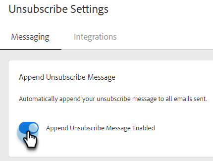

# Anexar automáticamente la configuración del mensaje de cancelación de suscripción {#auto-append-unsubscribe-message-setting}

Asegúrese de que cada correo electrónico enviado incluya un mensaje de cancelación de suscripción para que los destinatarios tengan una opción fácil de desactivar la comunicación. Cuando se activa la opción para anexar el mensaje de cancelación de suscripción, todas las comunicaciones que su equipo envíe desde Marketo Sales incluirán un mensaje de cancelación de suscripción, incluidos los correos electrónicos enviados desde la aplicación web, Salesforce, el complemento de Gmail y el complemento de Outlook.

## Cosas que hay que tener en cuenta {#things-to-note}

* En el caso de los correos electrónicos enviados desde los complementos, la cancelación de la suscripción solo se anexará cuando se utilice una plantilla.

* Si usa el `{{team_unsubscribe}}` campo dinámico en una plantilla de correo electrónico y la configuración cancelar la suscripción del mensaje anexado está habilitada, el campo dinámico cancelar la suscripción del equipo rellenará el mensaje cancelar la suscripción _en lugar de_ adjuntando el mensaje de cancelación de suscripción.

## Habilitar/deshabilitar la adición de cancelación de suscripción {#enable-disable-unsubscribe-append}

1. Haga clic en el icono del engranaje y seleccione **Configuración**.

   

1. En Configuración De Administración, Haga Clic En **Cancela la suscripción**.

   

1. En la pestaña Mensajería, en Anexar mensaje de cancelación de suscripción, mueva el control deslizante al estado deseado.

   

>[!TIP]
>
>Si desactiva la configuración del mensaje de cancelación de suscripción de datos anexados, le recomendamos que agregue un pie de página de cancelación de suscripción a las plantillas para garantizar que la comunicación tenga una opción de exclusión. Para ello, agregue su propio mensaje personalizado a cada plantilla o utilice el `{{team_unsubscribe}}` [campo dinámico](/help/marketo/product-docs/marketo-sales-connect/templates/dynamic-fields/dynamic-fields-glossary.md){target="_blank"}.
