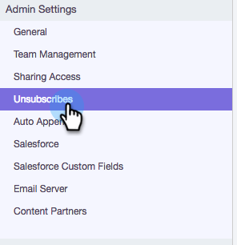

# Personalizar mensaje para cancelar la suscripción {#customize-unsubscribe-link-message}

Siempre hemos permitido que los equipos personalicen sus mensajes de enlace de baja de suscripción, pero ahora los administradores pueden configurar los mensajes de enlace de baja de suscripción para todo su equipo para garantizar una mensajería coherente.

>[!NOTE]
>
>No puede utilizar un enlace de baja de suscripción de terceros con Sales Connect, ya que esta información no se recuperará en nuestra base de datos.

## Personalizar la mensajería para usted mismo {#customize-messaging-for-yourself}

1. Inicie sesión en la [aplicación web](https://toutapp.com/login), haga clic en el icono del engranaje en la parte superior derecha y seleccione **Configuración**.

   

1. En Mi cuenta, seleccione **Cancelación de suscripción**.

   

1. Escriba la mensajería personalizada en el cuadro de texto.

   

1. Resalte el texto en el que desea que las personas hagan clic para llegar a la página de cancelación de suscripción y luego haga clic en el icono del vínculo.

   

   >[!NOTE]
   >
   >No importa cuál sea la dirección URL que se esté hiperenlazando. Cuando se envía el correo electrónico, el hipervínculo se convierte en nuestro vínculo de cancelación de suscripción.

1. Haga clic en **OK**.

   

## Configurar la mensajería de cancelación de suscripción para su equipo {#set-unsubscribe-messaging-for-your-team}

1. Inicie sesión en la [aplicación web](https://toutapp.com/login), haga clic en el icono del engranaje en la parte superior derecha y seleccione **Configuración**.

   

1. En Configuración de administración, seleccione **Cancelación de suscripción**.

   

1. Personalice la mensajería y haga clic en **Guardar** cuando haya terminado.

   

1. Select **Estoy configurando la mensajería predeterminada para mi equipo** para que la mensajería se aplique a todos los usuarios.

   
