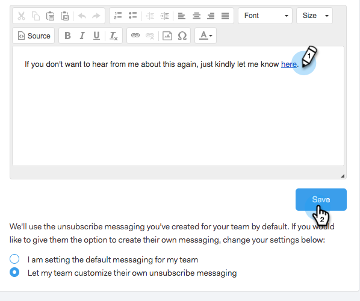

# Personalizar mensaje de vínculo de cancelación de suscripción {#customize-unsubscribe-link-message}

Siempre hemos permitido a los equipos personalizar su mensajería de vínculo de cancelación de suscripción, pero ahora los administradores pueden configurar la mensajería de vínculo de cancelación de suscripción para todo su equipo a fin de garantizar una mensajería coherente.

>[!NOTE]
>
>No puede utilizar un vínculo de cancelación de suscripción de terceros con Sales Connect, ya que esta información no se vuelve a capturar en nuestra base de datos.

## Personalice la mensajería para usted {#customize-messaging-for-yourself}

1. Inicie sesión en la [aplicación web](https://toutapp.com/login), haga clic en el icono de engranaje en la parte superior derecha y elija **Configuración**.

   

1. En Mi cuenta, seleccione **Cancelar suscripciones**.

   

1. Escriba su mensaje personalizado en el cuadro de texto.

   

1. Resalte el texto en el que desea que los usuarios hagan clic para llegar a la página de cancelación de suscripción y, a continuación, haga clic en el icono de vínculo.

   

   >[!NOTE]
   >
   >No importa cuál sea la dirección URL que se está hipervinculando. Cuando se envía el correo electrónico, ese hipervínculo se convierte en el vínculo de cancelación de suscripción.

1. Haga clic en **Aceptar**.

   

## Establecer la mensajería de cancelación de suscripción para su equipo {#set-unsubscribe-messaging-for-your-team}

1. Inicie sesión en la [aplicación web](https://toutapp.com/login), haga clic en el icono de engranaje en la parte superior derecha y elija **Configuración**.

   

1. En Configuración de administración, seleccione **Cancelaciones de suscripción**.

   

1. Personaliza tu mensaje y haz clic en **Guardar** cuando termines.

   

1. Seleccione **Estoy configurando la mensajería predeterminada para mi equipo** para que la mensajería se aplique a todos los usuarios.

   
