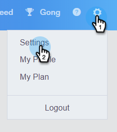
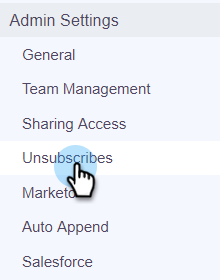

# Verificar cancelación de suscripción de Marketo {#marketo-unsubscribe-check}

La [!UICONTROL comprobación de cancelación de suscripción de Marketo] usa la conexión de su equipo con Marketo para evitar que los mensajes de correo electrónico se envíen a personas que cancelaron su suscripción en el sistema de administración de posibles clientes de Marketo. Cuando un usuario de ventas envía un correo electrónico con [!DNL Sales Connect], se realiza una llamada de API a Marketo para comprobar si se cancela la suscripción del ID de correo electrónico. Si es así, bloquearemos el envío del correo electrónico.

>[!NOTE]
>
>**Se requieren permisos de administrador**

## Encendiéndola... {#turning-it-on}

1. En la aplicación web, haga clic en el icono de engranaje y seleccione **[!UICONTROL Configuración]**.

   

1. En [!UICONTROL Configuración de administración], haga clic en **[!UICONTROL Cancelar suscripciones]**.

   

1. Haga clic en **[!UICONTROL Integraciones]**.

   

1. En la sección [!UICONTROL Comprobación de cancelación de suscripción de Marketo], haga clic en el control deslizante para activar la comprobación.

   

## Cosas que debe saber {#things-to-know}

Comprobación de cancelación de suscripción de Marketo...

* No cuenta con sus límites de API
* Requiere que se establezca una conexión de Marketo
* Es una configuración global
* Bloquea los correos electrónicos enviados desde la aplicación web, los clientes de correo electrónico y Salesforce
* Registrará un correo electrónico con errores o evitará que un usuario envíe mensajes cuando intente enviarlos para todos los flujos de trabajo (envío de complemento de correo electrónico, envío individual, envío de campaña de ventas, selección múltiple y envío) excepto para [correos electrónicos de grupo](/help/marketo/product-docs/marketo-sales-connect/email/using-the-compose-window/composing-bulk-emails-with-select-and-send.md), en los que evitaremos que los correos electrónicos se envíen en silencio
