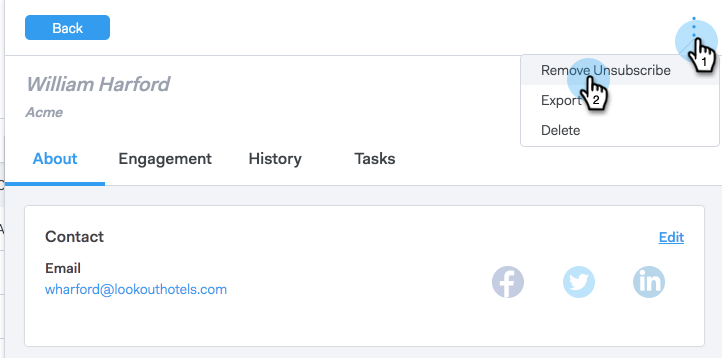

# Volver a suscribir a [!UICONTROL Cancelar la suscripción] {#resubscribing-an-unsubscribe}

A veces, las personas desean optar por volver a recibir correos electrónicos. Así es como hacer que las cancelaciones de suscripción sean nuevamente enviables.

>[!NOTE]
>
>**Se requieren permisos de administrador**

>[!CAUTION]
>
>Antes de volver a suscribir a una persona, debe poder demostrar que la autorización para volver a suscribirla está documentada y cumple con todas las leyes aplicables.

>[!NOTE]
>
>Si tiene activada la sincronización de cancelación de suscripción, debe quitar la cancelación de suscripción de ToutApp y desmarcar la exclusión en [!DNL Salesforce] para que el registro de persona no se vuelva a sincronizar.

1. Vaya a la [aplicación web](https://toutapp.com/login) y haga clic en **[!UICONTROL Personas]**.

1. Seleccione la persona para abrir la vista de detalles de la persona.

   

1. Haga clic en los tres puntos de la vista de detalles de la persona y seleccione **[!UICONTROL Quitar la suscripción]**.

   

1. Seleccione el motivo por el que la persona vuelve a recibir correos electrónicos y, a continuación, haga clic en **[!UICONTROL Quitar la suscripción]**.

   

>[!NOTE]
>
>Si tiene activada la sincronización de cancelación de suscripción, también debe desactivar la casilla de exclusión en el registro de Salesforce; de lo contrario, la sincronización nocturna volverá a cancelar la suscripción de la persona en [!DNL Sales Connect], ya que detectará que la persona está excluida en [!DNL Salesforce]. Si se excluye o se cancela la suscripción de cualquiera de los registros, la sincronización marcará el registro vinculado como tal.
